```mermaid
graph TD
    A[Customer sends PO] --> B[Sales Admin: Input SO]
    B --> C{Sales Manager Review}
    C -->|Reject| D[Notify Sales Admin]
    C -->|Approve| E[System Auto-trigger]
    E --> F[Check FG Stock]
    E --> G[Check Raw Material]
    E --> H[Update SO: CONFIRMED]
    F -->|Available| I[Reserve Stock → Logistics]
    F -->|Not Available| J[Create Production Planning]
    G -->|Below Reorder| K[Auto-create PR]
    H --> L[Notify: Production, Purchasing, Warehouse]
```

# Detailed Workflow Specifications

> **Source**: User-provided comprehensive workflow documentation
> **Date**: 2026-02-05

## Overview

This document captures the complete end-to-end workflow specifications for the ERP system, covering all modules from Sales Order to Finance, including customs compliance (BC 2.3 Import and BC 3.0 Export).

---

## A. Sales Order Workflow

### Process Flow

### Status Flow

`DRAFT` → `PENDING APPROVAL` → `APPROVED` → `IN PRODUCTION` → `READY TO SHIP` → `COMPLETED`

### Key Fields

- Customer, Product, Quantity, Delivery Date
- PO Document Upload
- Credit Limit Check
- Stock Availability Check

### Auto-triggers

- FG Stock check → Reserve or Create WO
- Raw Material check → Create PR if below reorder point
- Notifications to Production, Purchasing, Warehouse

---

## B. Purchasing & BC 2.3 (Import) Workflow

### Process Flow

### BC 2.3 Status Flow

`NOT REQUIRED` / `DRAFT` → `SUBMITTED` → `UNDER REVIEW` → `QUERY` → `APPROVED` → `CLOSED`

### PO Status Flow

`DRAFT` → `PENDING APPROVAL` → `APPROVED` → `SENT TO VENDOR` → `PARTIALLY RECEIVED` → `COMPLETED`

### Key Documents

- Commercial Invoice, Packing List, B/L
- HS Code, Origin, Value
- Duties & Taxes calculation
- SPPB (Surat Persetujuan Pengeluaran Barang)

---

## C. Warehouse Receiving (GR) Workflow

### Process Flow

### Status Flow

`PENDING ARRIVAL` → `DRAFT GR` → `QC INSPECTION` → `APPROVED` → `STOCK UPDATED`

### Key Actions

- Physical count, quality check, weighing
- Photo documentation
- BC 2.3 verification (for imports)
- 3-way matching trigger (PO-GR-Invoice)
- Stock card update, Laporan Mutasi Stok

---

## D. Production Workflow

### Process Flow

### Status Flow

`DRAFT` → `APPROVED` → `MATERIAL RESERVED` → `RELEASED` → `IN PROGRESS` → `COMPLETED` → `QC PASS` → `FG RECEIVED` → `CLOSED`

### Key Reports Auto-generated

1. **Laporan Hasil Produksi**
   - Target vs Actual output
   - Efficiency metrics
   - Quality metrics

2. **Konversi Bahan Baku Report**
   - Raw material consumed
   - Finished goods produced
   - Conversion ratio
   - Variance analysis (standard vs actual)
   - **Traceability**: BC 2.3 (import) → Production → BC 3.0 (export)

---

## E. Logistics & BC 3.0 (Export) Workflow

### Process Flow

### BC 3.0 Status Flow

`DRAFT` → `VERIFIED` → `SUBMITTED` → `UNDER REVIEW` → `APPROVED` → `EXPORTED` → `CLOSED`

### Shipment Status Flow

`DRAFT SI` → `CONFIRMED` → `BC 3.0 SUBMITTED` → `BC 3.0 APPROVED` → `LOADED` → `IN TRANSIT` → `DELIVERED` → `COMPLETED`

### Key Documents

- Commercial Invoice, Packing List
- Certificate of Origin (Form E, etc)
- Health Certificate
- PEB (Pemberitahuan Ekspor Barang)
- Bill of Lading / Airway Bill
- POD (Proof of Delivery)

---

## F. Finance Workflow

### Accounts Payable (AP)

### Accounts Receivable (AR)

### Invoice Status Flow

`DRAFT` → `APPROVED` → `SENT` → `PARTIALLY PAID` → `PAID` / `OVERDUE`

---

## G. Integration & Auto-triggers

### Cross-Module Triggers

| Trigger Event       | Auto Actions                                                                                                               |
| :------------------ | :------------------------------------------------------------------------------------------------------------------------- |
| **SO APPROVED**     | Check FG Stock → Reserve or Create WO Check Raw Material → Create PR if low Update Sales Dashboard                   |
| **PO APPROVED**     | Notify Warehouse for GR prep Create BC 2.3 template (imports) Update Purchasing Dashboard                            |
| **BC 2.3 APPROVED** | Notify Warehouse: Ready to receive Allow GR creation Update Compliance Dashboard                                     |
| **GR COMPLETED**    | Update Inventory Notify Production: Material available Trigger AP: Invoice matching Generate Laporan Mutasi Stok  |
| **WO COMPLETED**    | Update FG Inventory Generate Production Reports Generate Konversi Bahan Baku Notify Logistics Update SO status |
| **BC 3.0 APPROVED** | Allow shipment Generate export documents Update Compliance Dashboard                                                 |
| **GOODS SHIPPED**   | Update FG Stock Auto-generate Sales Invoice Update SO: SHIPPED Start shipment tracking                            |
| **INVOICE CREATED** | Generate Faktur Pajak Schedule email to customer Start payment monitoring Update AR Dashboard                     |

---

## H. Approval Matrix

| Document             | Level 1              | Level 2               | Level 3                       | Level 4          |
| :------------------- | :------------------- | :-------------------- | :---------------------------- | :--------------- |
| **Sales Order**      | Sales Admin (Create) | Sales Manager (>50M)  | Director (>500M)              | -                |
| **Purchase Request** | Requestor            | Dept Head             | Purchasing Mgr (>25M)         | -                |
| **Purchase Order**   | Purchasing Staff     | Purchasing Mgr (>50M) | Finance Mgr (>100M)           | Director (>500M) |
| **Goods Receipt**    | Warehouse Staff      | Warehouse Supervisor  | Purchasing Mgr (variance >5%) | -                |
| **Work Order**       | PPIC                 | Production Manager    | -                             | -                |
| **BC 2.3**           | Purchasing           | Finance               | Customs (External)            | -                |
| **BC 3.0**           | Logistics            | Finance               | Customs (External)            | -                |
| **Payment Voucher**  | AP Staff             | Finance Mgr (>25M)    | Director (>250M)              | -                |
| **Sales Invoice**    | AR Staff             | Finance Manager       | -                             | -                |

---

## I. Notification System

### Email Notifications

- SO Approved → Production (New WO needed)
- Stock below reorder → Purchasing (Create PR)
- PO Approved → Vendor (PO attached)
- GR Completed → Purchasing + Finance
- BC Submitted → Finance
- BC Approved → Warehouse/Logistics
- WO Completed → QC + Logistics
- Goods Shipped → Customer + Sales (tracking)
- Invoice Sent → Customer (Invoice + Faktur)
- Payment Due (3 days before) → Customer
- Payment Overdue → AR + Sales Manager

### Dashboard Alerts

🔴 **Critical**

- Stock critical level (<20% of reorder point)
- BC document rejected
- Payment overdue >30 days
- Production WO delayed >24 hours

🟡 **Warning**

- Stock below reorder point
- BC pending >3 days
- Payment due within 7 days
- PO delivery overdue

🟢 **Info**

- New SO awaiting approval
- GR completed
- WO completed
- Shipment delivered

---

## J. Reporting Requirements

### Daily Reports (Auto 06:00)

- Production Summary (yesterday)
- Stock Movement Report
- BC Status Dashboard
- Cash Flow Daily

### Weekly Reports (Monday 08:00)

- Sales Performance
- Production Efficiency
- Inventory Aging
- AP/AR Aging

### Monthly Reports (1st 08:00)

- Financial Statement (P&L, Balance Sheet)
- BC 2.3 & BC 3.0 Summary
- **Material Traceability Report**
- SPT PPN (Tax report)
- Vendor Performance
- Customer Sales Analysis

### On-Demand Reports

- Material Traceability Certificate (customs audit)
- Production Cost Analysis
- SO Fulfillment Report
- Quality Metrics Report

---

## Next Steps

This specification will guide the implementation plan for:

1. Database schema design
2. API endpoints definition
3. UI/UX flow implementation
4. Integration logic
5. Approval workflow engine
6. Notification system
7. Reporting module
