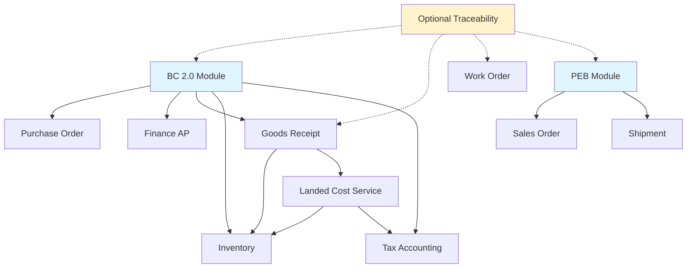

# BC 2.0 Regular Import System - Implementation Plan

> **Project**: JKJ Manufacturing ERP - BC 2.0 Implementation
> **Version**: 1.0
> **Last Updated**: March 9, 2026
> **System Type**: BC 2.0 Regular Import (NOT BC 2.3 Bonded Zone)

---

## 📋 Table of Contents

1. [Executive Summary](#executive-summary)
2. [Project Scope](#project-scope)
3. [Implementation Phases](#implementation-phases)
4. [Technical Architecture](#technical-architecture)
5. [Database Schema Design](#database-schema-design)
6. [API Endpoints](#api-endpoints)
7. [UI/UX Implementation](#uiux-implementation)
8. [Integration Points](#integration-points)
9. [Testing Strategy](#testing-strategy)
10. [Deployment Plan](#deployment-plan)
11. [Timeline & Milestones](#timeline--milestones)
12. [Risk Management](#risk-management)

---

## 🎯 Executive Summary

### Project Overview

Implement a comprehensive BC 2.0 Regular Import system for JKJ Manufacturing ERP, focusing on:

- **Dual Billing Management** (Vendor + Tax payments separated)
- **Upfront Tax Payment System** (blocking mechanism for goods receipt)
- **Landed Cost Calculation** (CIF + Bea Masuk + freight capitalized to inventory)
- **Tax Asset Accounting** (PPN & PPh 22 as prepaid tax assets)
- **Operational Flexibility** (no customs supervision, free domestic/export sales)
- **Optional Material Traceability** (internal quality control, not mandatory)

### Key Differentiators from BC 2.3

| Feature | BC 2.3 (Bonded) | BC 2.0 (Regular) ✅ |
|---------|-----------------|---------------------|
| Tax Payment | Deferred | **Upfront (blocking)** |
| Billing | Single | **Dual (Vendor + Tax)** |
| Inventory Cost | CIF only | **Landed Cost** |
| PPN & PPh | Deferred | **Prepaid Tax Assets** |
| Traceability | Mandatory | **Optional** |
| Export | BC 3.0 required | **Simple PEB** |
| Sales Flexibility | Export only | **Domestic or Export** |

### Success Metrics

- ✅ Accurate COGS with full landed cost
- ✅ Clear tax asset tracking (PPN & PPh 22)
- ✅ Timely tax payment monitoring (no GR blocking)
- ✅ Dual billing reconciliation 100% accurate
- ✅ Cash flow visibility (vendor + tax payments)

---

## 📦 Project Scope

### In Scope

#### Phase 1: BC 2.0 Import Module (Weeks 1-3)
- BC 2.0 document creation & management
- HS Code database & duty calculation
- Dual billing auto-generation (vendor + tax)
- Tax payment blocking mechanism
- SPPB tracking
- Document management system

#### Phase 2: Landed Cost & Tax Accounting (Weeks 4-5)
- Landed cost calculation engine
- Tax asset recording (PPN & PPh 22)
- Goods receipt integration with landed cost
- Automatic journal entry generation
- Inventory capitalization at landed cost

#### Phase 3: Finance Integration (Weeks 6-7)
- Dual billing in AP module
- Tax payment management
- PPN Import credit tracking
- PPh 22 prepaid tracking
- Monthly PPN reconciliation
- Cash flow forecasting (vendor + tax)

#### Phase 4: PEB Export Module (Weeks 8-9)
- PEB document creation (simple regular export)
- No mandatory BC 2.0 linkage
- Zero-rated VAT handling
- Export document checklist
- NPE tracking

#### Phase 5: Reporting & Dashboard (Weeks 10-11)
- BC 2.0 & Tax Dashboard
- Dual billing status reports
- Tax asset reports
- Landed cost analysis
- Stock movement with landed cost
- Cash flow forecast

#### Phase 6: Optional Traceability (Week 12)
- Optional lot tracking (BC 2.0 → GR → WO → FG → PEB)
- Internal quality control reports
- Material traceability certificates
- Conversion analysis (internal use)

### Out of Scope

- ❌ CEISA 4.0 API integration (future phase)
- ❌ Mobile app (future phase)
- ❌ Document OCR (future phase)
- ❌ BC 2.3 bonded zone functionality
- ❌ BC 3.0 bonded export functionality
- ❌ Mandatory customs traceability

---

## 🏗️ Implementation Phases

### Phase 1: BC 2.0 Import Module (Weeks 1-3)

#### Week 1: Database & Backend Setup ✅ **COMPLETED**

> **Status**: ✅ Completed on March 10, 2026
> **Commit**: `aefdf91` - feat(bc20): Implement BC 2.0 Regular Import Module - Phase 1 Week 1

**Tasks**:
1. ✅ Design database schema for BC 2.0 documents
2. ✅ Create HS Code master data tables
3. ✅ Implement duty calculation algorithms
4. ✅ Build BC 2.0 CRUD APIs
5. ✅ Implement dual billing generation logic

**Deliverables**:
- ✅ `bc20_documents` table schema (Prisma)
- ✅ `hs_codes` master data table
- ✅ `bc20_billings` via APBill with dual billing type
- ✅ API endpoints: `/api/bc20/*` (7 endpoints)
- ✅ Duty calculation service (`lib/bc20/calculations.ts`)

**Implementation Notes**:
- Used Prisma ORM v5.22.0 with PostgreSQL
- Created comprehensive schema with 15+ models
- Implemented transaction-based dual billing generation
- Added tax asset models (PPN Import & PPh 22)
- Built landed cost calculation engine
- All API endpoints with proper validation & error handling
- Frontend: Renamed bc23 → bc20, updated list page

**Technical Specs**:
```typescript
// Database Schema
interface BC20Document {
  id: string;
  bcNumber: string; // PIB-2026-001
  poId: string;
  poNumber: string;
  supplierId: string;
  supplierName: string;

  // Import Details
  portOfEntry: string;
  importDate: Date;
  containerNumber: string;
  vesselName?: string;
  blNumber: string;

  // Goods Information
  hsCode: string;
  hsCodeDescription: string;
  goodsDescription: string;
  countryOfOrigin: string;
  quantity: number;
  uom: string;

  // Financial - CIF Calculation
  fobValue: number;
  currency: string; // USD, EUR, etc.
  freightCost: number;
  insuranceCost: number;
  cifValue: number; // Auto: FOB + Freight + Insurance
  exchangeRate: number; // To IDR
  cifValueIDR: number;

  // Duties Calculation
  duties: {
    beaMasuk: number; // CIF × HS duty rate
    beaMasukRate: number; // From HS Code (e.g., 5%)
    ppn: number; // (CIF + Bea Masuk) × 11%
    pph22: number; // CIF × PPh rate
    pph22Rate: number; // 2.5% (API), 7.5% (non-API), 10% (no NPWP)
    totalDuties: number;
  };

  // Dual Billing
  billings: {
    vendorBilling: {
      id: string;
      amount: number; // CIF value
      currency: string;
      amountIDR: number;
      dueDate: Date;
      paymentTerms: string; // e.g., "30 days from B/L date"
      status: 'PENDING' | 'PAID';
      paidDate?: Date;
      paidAmount?: number;
      paymentRef?: string;
    };
    taxBilling: {
      id: string;
      beaMasuk: number;
      ppn: number;
      pph22: number;
      totalAmount: number; // In IDR
      status: 'UNPAID' | 'PAID';
      paymentDeadline: Date; // Urgent - blocks GR
      paidDate?: Date;
      paymentRef?: string; // Bank transfer reference
      sppbNumber?: string; // Customs release approval
    };
  };

  // Landed Cost Preview
  landedCost: {
    cifValue: number;
    beaMasuk: number;
    domesticFreight: number;
    handlingFees: number;
    otherCosts: number;
    totalLandedCost: number;
    unitCost: number;
    // Note: PPN & PPh NOT included (tax assets)
  };

  // Customs Status
  status: 'DRAFT' | 'SUBMITTED' | 'UNDER_CUSTOMS_REVIEW' |
          'TAX_PAYMENT_PENDING' | 'TAX_PAID' | 'CUSTOMS_RELEASED' |
          'GOODS_RECEIVED' | 'CLOSED';
  sppbNumber?: string;
  sppbDate?: Date;
  customsOfficer?: string;

  // Documents
  documents: {
    commercialInvoice: { uploaded: boolean; fileUrl?: string; uploadedAt?: Date };
    packingList: { uploaded: boolean; fileUrl?: string; uploadedAt?: Date };
    billOfLading: { uploaded: boolean; fileUrl?: string; uploadedAt?: Date };
    certificateOfOrigin: { uploaded: boolean; fileUrl?: string; uploadedAt?: Date };
    taxPaymentProof: { uploaded: boolean; fileUrl?: string; uploadedAt?: Date };
  };

  // Optional Traceability
  lotNumber?: string; // e.g., RM-2026-001 (optional)

  // Audit Trail
  createdBy: string;
  createdAt: Date;
  updatedBy: string;
  updatedAt: Date;
  submittedBy?: string;
  submittedAt?: Date;
  approvedBy?: string;
  approvedAt?: Date;
}

// HS Code Master Data
interface HSCode {
  code: string; // 8471.30.00
  description: string;
  dutyRate: number; // 0% - 40%
  ppnRate: number; // 11% (standard)
  pph22Rates: {
    withAPI: number; // 2.5%
    withoutAPI: number; // 7.5%
    noNPWP: number; // 10%
  };
  category: string;
  notes?: string;
}
```

#### Week 2: BC 2.0 UI Components ✅ **COMPLETED**

> **Status**: ✅ Completed on March 10, 2026
> **Commits**:
> - `03fdc43` - feat(bc20): add BC 2.0 creation form with auto-calculation
> - `9501e57` - feat(bc20): add tax payment dialog for BC 2.0
> - `e0d2fb0` - feat(bc20): add HS Code selector component with search
> - `8d3263b` - feat(bc20): add document upload component and integrate with BC 2.0

**Tasks**:
1. ✅ Build BC 2.0 list page (`/purchasing/bc20`)
2. ✅ Create BC 2.0 detail page (`/purchasing/bc20/[id]`)
3. ✅ Implement BC 2.0 creation form (`/purchasing/bc20/new`)
4. ✅ Build dual billing display component
5. ✅ Create status timeline component
6. ✅ Add tax payment dialog/modal
7. ✅ Create HS Code selector with search
8. ✅ Implement document upload component

**Deliverables**:
- ✅ BC 2.0 list with filters & search
- ✅ BC 2.0 detail with dual billing display
- ✅ BC 2.0 creation form with auto-calculations
- ✅ Status badges & timeline
- ✅ Tax payment dialog with validation
- ✅ HS Code searchable combobox
- ✅ Document upload UI with drag-and-drop
- ✅ BC 2.0 card on purchasing dashboard

**Implementation Notes**:
- Built comprehensive BC 2.0 detail page with dual billing cards (Vendor Bill + Tax Bill)
- Implemented real-time duty and tax auto-calculation in creation form
- Created tax payment dialog integrated with `/api/bc20/[id]/pay-tax` endpoint
- Developed searchable HS Code selector component with duty rate display
- Built reusable document upload component with drag-and-drop, validation, and progress
- Added BC 2.0 module card to purchasing dashboard for better visibility
- All components use shadcn/ui with consistent design system

**UI Components**:
```typescript
// Key Components Implemented
✅ BC20ListPage - Table with status badges, search, filters
✅ BC20DetailPage - Full document view with dual billing
✅ BC20CreateForm - Multi-section form with auto-calculations
✅ DualBillingCard - Vendor + tax billing side-by-side
✅ LandedCostPreview - Cost breakdown with alerts
✅ StatusTimeline - Visual progress indicator
✅ TaxPaymentDialog - Payment recording with validation
✅ HSCodeSelector - Searchable combobox with duty rates
✅ DocumentUpload - Drag-and-drop with progress tracking
✅ TaxPaymentAlert - Blocking warning for upfront tax payment
```

**Technical Specs**:
```typescript
// Auto-calculation Logic
useEffect(() => {
  // Get duty rate from selected HS Code
  const dutyRate = selectedHSCode?.dutyRate || 5.0;

  // BC 2.0 Tax Calculations
  // 1. Bea Masuk = CIF × Duty Rate
  const beaMasuk = cifInIdr * (dutyRate / 100);

  // 2. PPN Import = (CIF + Bea Masuk) × 11%
  const ppn = (cifInIdr + beaMasuk) * 0.11;

  // 3. PPh 22 = (CIF + Bea Masuk) × 2.5%
  const pph22 = (cifInIdr + beaMasuk) * 0.025;

  // Landed Cost = CIF + Bea Masuk + Freight + Insurance + Handling
  // Note: PPN & PPh22 NOT included (tax assets)
  const landedCost = cifInIdr + beaMasuk + freight + insurance + handling;

  // Dual Billing
  setVendorBillAmount(cifInIdr); // Vendor payment
  setTaxBillAmount(beaMasuk + ppn + pph22); // Tax payment
}, [cifValue, exchangeRate, selectedHSCode, freightCost, insuranceCost, handlingCost]);

// Document Upload Features
- Drag-and-drop file upload with visual feedback
- File validation (size: max 10MB, formats: .pdf, .jpg, .png)
- Upload progress indicator with percentage
- Error handling with retry option
- Uploaded file card with metadata (size, date, uploader)
- View, download, and delete actions
- Status-based styling (green: uploaded, red: error, orange: pending)
```

#### Week 3: Dual Billing & Tax Payment Logic ✅ **COMPLETED**

> **Status**: ✅ Completed on March 11, 2026
> **Commits**:
> - `91b23c9` - feat(bc20): add dual billing auto-generation and tax payment blocking
> - `a0db80b` - feat(bc20): integrate dual billing and SPPB workflow in detail page

**Tasks**:
1. ✅ Implement auto-billing generation on BC 2.0 submit
2. ✅ Build tax payment blocking mechanism
3. ✅ Create tax payment workflow (from Week 2)
4. ✅ Integrate with Finance AP module (via APBill)
5. ✅ Implement SPPB tracking

**Deliverables**:
- ✅ Auto-generate 2 billings on BC 2.0 submission
- ✅ GR blocked until status = "CUSTOMS_RELEASED"
- ✅ Tax payment recording system (from Week 2)
- ✅ SPPB auto-update BC 2.0 status
- ⏳ Email alerts for tax payment pending (TODO: future enhancement)

**Implementation Notes**:
- Created POST /api/bc20/[id]/submit for dual billing auto-generation
- Created GET /api/bc20/[id]/check-gr-eligibility for tax payment blocking
- Created POST /api/bc20/[id]/record-sppb for SPPB tracking
- Integrated submit and SPPB workflows into BC 2.0 detail page
- Submit button generates Vendor Bill (30 days) + Tax Bill (3 days URGENT)
- GR eligibility check validates tax payment and SPPB before allowing receipt
- SPPB recording auto-updates status to CUSTOMS_RELEASED and unblocks GR

**API Endpoints Created**:
```typescript
// Week 3 New Endpoints
POST   /api/bc20/[id]/submit              // Submit BC 2.0 + generate dual billing
GET    /api/bc20/[id]/check-gr-eligibility // Check if GR is allowed (blocking)
POST   /api/bc20/[id]/record-sppb         // Record SPPB (customs release)

// From Week 2 (tax payment)
POST   /api/bc20/[id]/pay-tax             // Record tax payment
```

**Business Logic**:
```typescript
// On BC 2.0 Submit
async function onBC20Submit(bc20: BC20Document) {
  // 1. Calculate duties
  const duties = calculateDuties(bc20);

  // 2. Generate Vendor Billing (AP Invoice)
  const vendorBilling = {
    type: 'VENDOR_PAYMENT',
    supplierId: bc20.supplierId,
    amount: bc20.cifValue,
    currency: bc20.currency,
    dueDate: calculateDueDate(bc20.paymentTerms),
    status: 'PENDING',
    reference: bc20.bcNumber,
  };
  await createAPInvoice(vendorBilling);

  // 3. Generate Tax Billing (Customs Payment)
  const taxBilling = {
    type: 'TAX_PAYMENT',
    recipient: 'DJBC', // Directorate General of Customs
    beaMasuk: duties.beaMasuk,
    ppn: duties.ppn,
    pph22: duties.pph22,
    totalAmount: duties.totalDuties,
    status: 'UNPAID',
    paymentDeadline: new Date(Date.now() + 3 * 24 * 60 * 60 * 1000), // 3 days
    reference: bc20.bcNumber,
  };
  await createTaxPayment(taxBilling);

  // 4. Update BC 2.0 status
  bc20.status = 'SUBMITTED';
  await updateBC20(bc20);

  // 5. Send alerts
  await sendAlert({
    to: 'finance@jkj.com',
    subject: 'Tax Payment Required - BC 2.0 ' + bc20.bcNumber,
    message: 'Upfront tax payment required to release goods',
    amount: duties.totalDuties,
    deadline: taxBilling.paymentDeadline,
  });

  // 6. Block goods receipt
  await blockGoodsReceipt(bc20.poId, 'TAX_PAYMENT_PENDING');
}

// On Tax Payment Recorded
async function onTaxPaymentRecorded(bc20Id: string, paymentProof: File) {
  const bc20 = await getBC20(bc20Id);

  // 1. Update tax billing status
  bc20.billings.taxBilling.status = 'PAID';
  bc20.billings.taxBilling.paidDate = new Date();
  bc20.billings.taxBilling.paymentRef = paymentProof.filename;

  // 2. Update BC 2.0 status
  bc20.status = 'TAX_PAID';
  await updateBC20(bc20);

  // 3. Wait for SPPB from customs (manual or API)
  // When SPPB received:
  // bc20.status = 'CUSTOMS_RELEASED';
  // await unblockGoodsReceipt(bc20.poId);
}

// Duty Calculation
function calculateDuties(bc20: BC20Document) {
  const hsCode = await getHSCode(bc20.hsCode);
  const cifIDR = bc20.cifValue * bc20.exchangeRate;

  const beaMasuk = cifIDR * hsCode.dutyRate;
  const ppn = (cifIDR + beaMasuk) * 0.11;
  const pph22 = cifIDR * getPPh22Rate(bc20.supplierId); // Based on API status

  return {
    beaMasuk,
    beaMasukRate: hsCode.dutyRate,
    ppn,
    pph22,
    pph22Rate: getPPh22Rate(bc20.supplierId),
    totalDuties: beaMasuk + ppn + pph22,
  };
}
```

---

### Phase 2: Landed Cost & Tax Accounting (Weeks 4-5)

#### Week 4: Landed Cost Calculation Engine

**Tasks**:
1. Build landed cost calculation service
2. Implement automatic calculation on GR
3. Create landed cost components breakdown
4. Integrate with inventory valuation
5. Build landed cost adjustment workflow

**Deliverables**:
- Landed cost calculation service
- Auto-calculate on goods receipt
- Cost breakdown report
- Inventory update at landed cost
- Variance tracking & alerts

**Technical Specs**:
```typescript
// Landed Cost Calculation
interface LandedCostCalculation {
  bc20Id: string;
  poId: string;
  grId: string;

  // Components (all in IDR)
  components: {
    cifValue: number; // FOB + Freight + Insurance
    beaMasuk: number; // Import duty (capitalized)
    internationalFreight: number; // Already in CIF
    insurance: number; // Already in CIF
    domesticFreight: number; // Port to warehouse
    handlingFees: number; // Port charges, customs broker
    customsBrokerFee: number;
    portCharges: number;
    otherCosts: number;
  };

  // Total Landed Cost (capitalized to inventory)
  totalLandedCost: number; // Sum of above
  quantity: number;
  unitLandedCost: number; // Total / Quantity

  // Tax Assets (NOT capitalized to inventory)
  taxAssets: {
    ppnImport: number; // Prepaid tax asset
    pph22Import: number; // Prepaid tax asset
  };

  // Journal Entry Preview
  journalEntry: {
    debit: [
      { account: 'Raw Material Inventory', amount: number }, // Landed Cost
      { account: 'PPN Prepaid', amount: number }, // Tax Asset
      { account: 'PPh 22 Prepaid', amount: number }, // Tax Asset
    ],
    credit: [
      { account: 'AP - Vendor', amount: number }, // CIF
      { account: 'AP - Customs', amount: number }, // Bea Masuk
      { account: 'AP - Freight', amount: number }, // Domestic freight
      { account: 'AP - Handling', amount: number }, // Port charges
    ],
  };
}

// On Goods Receipt
async function onGoodsReceipt(gr: GoodsReceipt) {
  const bc20 = await getBC20ByPO(gr.poId);

  if (!bc20 || bc20.status !== 'CUSTOMS_RELEASED') {
    throw new Error('Cannot receive goods - BC 2.0 not released by customs');
  }

  // 1. Calculate Landed Cost
  const landedCost = calculateLandedCost({
    cifValue: bc20.cifValueIDR,
    beaMasuk: bc20.duties.beaMasuk,
    domesticFreight: gr.freightCost || 0,
    handlingFees: gr.handlingFees || 0,
    quantity: gr.quantity,
  });

  // 2. Update Inventory at Landed Cost
  await updateInventory({
    materialId: gr.materialId,
    quantity: gr.quantity,
    unitCost: landedCost.unitLandedCost, // NOT just CIF!
    lotNumber: bc20.lotNumber,
    bc20Reference: bc20.bcNumber,
  });

  // 3. Record Tax Assets (NOT inventory cost)
  await recordTaxAsset({
    type: 'PPN_IMPORT',
    amount: bc20.duties.ppn,
    bc20Id: bc20.id,
    grId: gr.id,
    description: `PPN Import - ${bc20.bcNumber}`,
  });

  await recordTaxAsset({
    type: 'PPH22_IMPORT',
    amount: bc20.duties.pph22,
    bc20Id: bc20.id,
    grId: gr.id,
    description: `PPh 22 Import - ${bc20.bcNumber}`,
  });

  // 4. Generate Journal Entry
  await createJournalEntry(landedCost.journalEntry);

  // 5. Update BC 2.0 status
  bc20.status = 'GOODS_RECEIVED';
  await updateBC20(bc20);
}
```

#### Week 5: Tax Asset Accounting

**Tasks**:
1. Create tax asset tables & APIs
2. Build PPN credit tracking system
3. Build PPh 22 prepaid tracking
4. Implement monthly PPN reconciliation
5. Create tax asset reports

**Deliverables**:
- Tax asset master table
- PPN credit tracking
- PPh 22 annual tracking
- Monthly PPN reconciliation report
- Tax asset dashboard

**Database Schema**:
```typescript
interface TaxAsset {
  id: string;
  type: 'PPN_IMPORT' | 'PPH22_IMPORT';

  // Source Document
  bc20Id: string;
  bc20Number: string;
  grId: string;

  // Amounts
  amount: number; // In IDR
  amountUsed: number; // Credit utilized
  amountRemaining: number; // Available credit

  // PPN Specific
  period?: string; // 'YYYY-MM' for monthly reconciliation
  creditedAgainstOutput?: number; // PPN Keluaran offset

  // PPh 22 Specific
  fiscalYear?: number;
  creditedAgainstIncomeTax?: number;

  // Status
  status: 'AVAILABLE' | 'PARTIALLY_USED' | 'FULLY_USED' | 'EXPIRED';

  // Dates
  recordedDate: Date;
  availableFrom: Date;
  expiryDate?: Date; // PPN credit may expire

  // Audit
  createdBy: string;
  createdAt: Date;
}

// PPN Reconciliation (Monthly)
interface PPNReconciliation {
  period: string; // 'YYYY-MM'

  // Input VAT (Credits)
  ppnMasukan: {
    ppnImport: number; // From BC 2.0
    ppnDomesticPurchase: number; // From local purchases
    totalPPNMasukan: number;
  };

  // Output VAT (Charges)
  ppnKeluaran: {
    ppnDomesticSales: number; // 11% on domestic sales
    ppnExportSales: number; // 0% (zero-rated)
    totalPPNKeluaran: number;
  };

  // Net Position
  netPPN: number; // Output - Input
  status: 'PAYABLE' | 'CREDITABLE' | 'BALANCED';

  // If payable: amount to pay to tax office
  // If creditable: carry forward to next month
  amountPayable?: number;
  amountCarryForward?: number;

  // SPT Filing
  sptFiled: boolean;
  sptFiledDate?: Date;
  sptReference?: string;
}
```

---

### Phase 3: Finance Integration (Weeks 6-7)

#### Week 6: Dual Billing in AP Module

**Tasks**:
1. Update AP module for dual billing display
2. Implement vendor payment workflow
3. Implement tax payment workflow
4. Build payment reconciliation
5. Create cash flow forecast (vendor + tax)

**Deliverables**:
- AP dashboard with dual billing view
- Vendor payment processing
- Tax payment processing
- Payment reconciliation reports
- Cash flow forecast (30/60/90 days)

**UI Components**:
```typescript
// AP Dashboard Updates
- Dual Billing Summary Card
  - Outstanding Vendor Payments (CIF)
  - Outstanding Tax Payments (Duties)
  - Total Cash Outflow Forecast

- Payment Status Table
  - Column: Type (Vendor | Tax)
  - Column: BC 2.0 Reference
  - Column: Amount & Currency
  - Column: Due Date
  - Column: Status
  - Action: Record Payment

// Cash Flow Forecast
- 30 days: Vendor payments + Tax payments
- 60 days: Projected payments
- 90 days: Long-term forecast
- Chart: Cash outflow by type (Vendor | Tax | Other)
```

#### Week 7: Tax Asset Management UI

**Tasks**:
1. Build tax asset dashboard (`/finance/tax-assets`)
2. Create PPN credit tracking page
3. Create PPh 22 tracking page
4. Build monthly PPN reconciliation tool
5. Generate tax reports

**Deliverables**:
- Tax asset dashboard
- PPN credit utilization tracking
- PPh 22 annual tracking
- Monthly PPN reconciliation form
- Tax asset reports (PDF/Excel)

**Pages**:
```
/finance/tax-assets
  - Dashboard (PPN & PPh balance)
  - PPN Import Credits (/finance/tax-assets/ppn)
    - Available balance
    - Monthly usage
    - Reconciliation tool
  - PPh 22 Prepaid (/finance/tax-assets/pph22)
    - YTD balance
    - Annual tax credit
    - Utilization report
```

---

### Phase 4: PEB Export Module (Weeks 8-9)

#### Week 8: PEB Document Management

**Tasks**:
1. Create PEB database schema
2. Build PEB CRUD APIs
3. Implement PEB creation form
4. Build PEB detail page
5. Implement zero-rated VAT logic

**Deliverables**:
- `peb_documents` table
- PEB API endpoints
- PEB creation form (`/logistics/peb/new`)
- PEB detail page (`/logistics/peb/[id]`)
- VAT zero-rating on export sales

**Database Schema**:
```typescript
interface PEBDocument {
  id: string;
  pebNumber: string; // PEB-2026-001
  npeNumber: string; // Nomor Pendaftaran Eksportir

  // Sales Order Link
  soId: string;
  soNumber: string;
  customerId: string;
  customerName: string;

  // Export Details
  destinationCountry: string;
  portOfLoading: string;
  exportDate: Date;
  vesselName?: string;
  containerNumber?: string;
  blNumber?: string;

  // Goods Information
  goodsDescription: string;
  hsCode: string; // Export HS Code
  quantity: number;
  uom: string;
  fobValue: number;
  currency: string;
  fobValueIDR: number;

  // Optional Traceability (Internal Use)
  woId?: string; // Link to Work Order (optional)
  fgLotNumber?: string; // Finished Goods lot (optional)
  bc20Reference?: string; // Link to BC 2.0 (optional, for internal tracking)

  // Documents
  documents: {
    commercialInvoice: { uploaded: boolean; fileUrl?: string };
    packingList: { uploaded: boolean; fileUrl?: string };
    certificateOfOrigin: { uploaded: boolean; fileUrl?: string };
    healthCertificate: { uploaded: boolean; fileUrl?: string };
    formE: { uploaded: boolean; fileUrl?: string };
    other: { uploaded: boolean; fileUrl?: string };
  };

  // Status
  status: 'DRAFT' | 'VERIFIED' | 'SUBMITTED' | 'UNDER_REVIEW' |
          'APPROVED' | 'EXPORTED' | 'CLOSED';

  // VAT
  vatRate: 0; // Zero-rated for exports
  vatAmount: 0;

  // Audit
  createdBy: string;
  createdAt: Date;
  approvedBy?: string;
  approvedAt?: Date;
}
```

#### Week 9: PEB Integration & Reports

**Tasks**:
1. Integrate PEB with Sales Order
2. Build PEB list & dashboard
3. Create export shipment workflow
4. Implement export document generation
5. Build export reports

**Deliverables**:
- PEB list page (`/logistics/peb`)
- PEB dashboard with stats
- Export shipment tracking
- Export document templates
- Export summary reports

---

### Phase 5: Reporting & Dashboard (Weeks 10-11)

#### Week 10: BC 2.0 & Tax Dashboard

**Tasks**:
1. Build BC 2.0 dashboard (`/purchasing/bc20/dashboard`)
2. Create tax payment monitoring
3. Build dual billing status widget
4. Create tax asset balance widget
5. Implement landed cost summary

**Deliverables**:
- BC 2.0 dashboard page
- Tax payment alerts
- Dual billing status cards
- Tax asset balance display
- Landed cost summary by material

**Dashboard Widgets**:
```typescript
// BC 2.0 & Tax Dashboard
- Overview Cards
  - BC 2.0 Active (count + total value)
  - Tax Payment Pending (count + amount) - RED ALERT
  - Customs Released This Month
  - Total Duties Paid (YTD)

- Dual Billing Status
  - Vendor Payments Outstanding
  - Tax Payments Outstanding
  - Cash Outflow Forecast Chart

- Tax Asset Balance
  - PPN Import Available (IDR)
  - PPh 22 Prepaid (IDR)
  - Monthly Utilization Trend

- Landed Cost Summary
  - Average Landed Cost by Material
  - Cost Variance Alerts
  - Duty Rate Changes

- Recent Activities
  - BC 2.0 submissions
  - Tax payments recorded
  - SPPB received
  - Goods receipts completed
```

#### Week 11: Reports Implementation

**Tasks**:
1. Build stock movement report with landed cost
2. Create dual billing reconciliation report
3. Build tax asset utilization report
4. Create landed cost analysis report
5. Implement cash flow forecast report

**Deliverables**:
- Stock movement report (`/reports/stock-movement`)
- Dual billing reconciliation report
- Tax asset report (PPN & PPh)
- Landed cost analysis
- Cash flow forecast (vendor + tax)

**Report Specs**:
```typescript
// Stock Movement Report
- Filters: Period, Material, Transaction Type
- Columns:
  - Date, Type, Reference (BC 2.0/WO/PO)
  - Lot Number (optional)
  - Qty In, Qty Out
  - Unit Cost (Landed Cost for imports)
  - Running Balance
- Export: Excel, PDF

// Dual Billing Report
- Period filter
- BC 2.0 list with:
  - Vendor billing status & amount
  - Tax billing status & amount
  - Payment dates
  - Outstanding amounts
- Total vendor payments vs tax payments

// Tax Asset Report
- PPN Import Credits
  - Total available
  - Monthly usage
  - Remaining balance
- PPh 22 Prepaid
  - YTD total
  - Annual tax credit available
- Linked BC 2.0 references

// Landed Cost Analysis
- Period & material filters
- Breakdown by component:
  - CIF value
  - Bea Masuk
  - Freight
  - Handling
  - Total Landed Cost
- Variance analysis (vs previous period)
- Cost trend chart
```

---

### Phase 6: Optional Traceability (Week 12)

#### Week 12: Internal Traceability System

**Tasks**:
1. Implement optional lot tracking
2. Build traceability chain visualization
3. Create traceability report page
4. Implement conversion analysis
5. Generate material certificates

**Deliverables**:
- Optional lot number assignment
- Traceability chain component
- Traceability report (`/reports/traceability`)
- Conversion analysis (internal)
- Material traceability certificate template

**Important Notes**:
- ⚠️ This is **OPTIONAL** for BC 2.0 (not mandatory for customs)
- Used for **internal quality control** only
- Supports ISO certification requirements
- Customer-specific transparency needs
- NOT required for customs audit

---

## 🗄️ Database Schema Design

### Core Tables

```sql
-- BC 2.0 Documents
CREATE TABLE bc20_documents (
  id UUID PRIMARY KEY,
  bc_number VARCHAR(50) UNIQUE NOT NULL,
  po_id UUID REFERENCES purchase_orders(id),
  po_number VARCHAR(50),
  supplier_id UUID REFERENCES suppliers(id),

  -- Import Details
  port_of_entry VARCHAR(100),
  import_date DATE,
  container_number VARCHAR(50),
  vessel_name VARCHAR(100),
  bl_number VARCHAR(50),

  -- Goods
  hs_code VARCHAR(20),
  goods_description TEXT,
  country_of_origin VARCHAR(50),
  quantity DECIMAL(15,3),
  uom VARCHAR(20),

  -- Financial (in original currency)
  fob_value DECIMAL(15,2),
  currency VARCHAR(3),
  freight_cost DECIMAL(15,2),
  insurance_cost DECIMAL(15,2),
  cif_value DECIMAL(15,2),
  exchange_rate DECIMAL(15,4),

  -- Financial (in IDR)
  cif_value_idr DECIMAL(15,2),
  bea_masuk DECIMAL(15,2),
  bea_masuk_rate DECIMAL(5,4),
  ppn DECIMAL(15,2),
  pph22 DECIMAL(15,2),
  pph22_rate DECIMAL(5,4),
  total_duties DECIMAL(15,2),

  -- Status
  status VARCHAR(30),
  sppb_number VARCHAR(50),
  sppb_date DATE,

  -- Optional Traceability
  lot_number VARCHAR(50),

  -- Audit
  created_by UUID,
  created_at TIMESTAMP DEFAULT NOW(),
  updated_at TIMESTAMP DEFAULT NOW(),
  submitted_at TIMESTAMP,
  approved_at TIMESTAMP
);

-- Dual Billing
CREATE TABLE bc20_billings (
  id UUID PRIMARY KEY,
  bc20_id UUID REFERENCES bc20_documents(id),
  billing_type VARCHAR(20), -- 'VENDOR' or 'TAX'

  -- Vendor Billing
  amount DECIMAL(15,2),
  currency VARCHAR(3),
  amount_idr DECIMAL(15,2),
  due_date DATE,
  payment_terms VARCHAR(100),

  -- Tax Billing
  bea_masuk DECIMAL(15,2),
  ppn DECIMAL(15,2),
  pph22 DECIMAL(15,2),
  payment_deadline DATE,

  -- Payment
  status VARCHAR(20), -- 'PENDING', 'PAID'
  paid_date DATE,
  paid_amount DECIMAL(15,2),
  payment_ref VARCHAR(100),

  created_at TIMESTAMP DEFAULT NOW()
);

-- Landed Cost
CREATE TABLE landed_costs (
  id UUID PRIMARY KEY,
  bc20_id UUID REFERENCES bc20_documents(id),
  po_id UUID REFERENCES purchase_orders(id),
  gr_id UUID REFERENCES goods_receipts(id),

  -- Components (all in IDR)
  cif_value DECIMAL(15,2),
  bea_masuk DECIMAL(15,2),
  domestic_freight DECIMAL(15,2),
  handling_fees DECIMAL(15,2),
  customs_broker_fee DECIMAL(15,2),
  port_charges DECIMAL(15,2),
  other_costs DECIMAL(15,2),

  -- Total
  total_landed_cost DECIMAL(15,2),
  quantity DECIMAL(15,3),
  unit_landed_cost DECIMAL(15,4),

  created_at TIMESTAMP DEFAULT NOW()
);

-- Tax Assets
CREATE TABLE tax_assets (
  id UUID PRIMARY KEY,
  type VARCHAR(20), -- 'PPN_IMPORT' or 'PPH22_IMPORT'
  bc20_id UUID REFERENCES bc20_documents(id),
  gr_id UUID REFERENCES goods_receipts(id),

  -- Amounts
  amount DECIMAL(15,2),
  amount_used DECIMAL(15,2) DEFAULT 0,
  amount_remaining DECIMAL(15,2),

  -- PPN Specific
  period VARCHAR(7), -- 'YYYY-MM'
  credited_against_output DECIMAL(15,2),

  -- PPh 22 Specific
  fiscal_year INTEGER,
  credited_against_income_tax DECIMAL(15,2),

  -- Status
  status VARCHAR(20), -- 'AVAILABLE', 'PARTIALLY_USED', 'FULLY_USED'
  recorded_date DATE,
  expiry_date DATE,

  created_at TIMESTAMP DEFAULT NOW()
);

-- PEB Export Documents
CREATE TABLE peb_documents (
  id UUID PRIMARY KEY,
  peb_number VARCHAR(50) UNIQUE,
  npe_number VARCHAR(50),

  -- Sales Order
  so_id UUID REFERENCES sales_orders(id),
  customer_id UUID REFERENCES customers(id),

  -- Export Details
  destination_country VARCHAR(50),
  port_of_loading VARCHAR(100),
  export_date DATE,

  -- Goods
  goods_description TEXT,
  hs_code VARCHAR(20),
  quantity DECIMAL(15,3),
  uom VARCHAR(20),
  fob_value DECIMAL(15,2),
  currency VARCHAR(3),

  -- Optional Traceability (Internal)
  wo_id UUID REFERENCES work_orders(id),
  fg_lot_number VARCHAR(50),
  bc20_reference VARCHAR(50),

  -- Status
  status VARCHAR(30),

  -- VAT (zero-rated)
  vat_rate DECIMAL(5,4) DEFAULT 0,
  vat_amount DECIMAL(15,2) DEFAULT 0,

  created_at TIMESTAMP DEFAULT NOW(),
  approved_at TIMESTAMP
);

-- Stock Movements (with Landed Cost)
CREATE TABLE stock_movements (
  id UUID PRIMARY KEY,
  material_id UUID REFERENCES materials(id),
  transaction_date DATE,
  transaction_type VARCHAR(30),
  reference_type VARCHAR(20), -- 'BC20', 'PEB', 'WO', 'SO'
  reference_id UUID,
  reference_number VARCHAR(50),

  -- Lot tracking (optional)
  lot_number VARCHAR(50),

  -- Movement
  quantity_in DECIMAL(15,3),
  quantity_out DECIMAL(15,3),

  -- Cost (Landed Cost for imports)
  unit_cost DECIMAL(15,4),
  total_value DECIMAL(15,2),

  -- Balance
  running_balance DECIMAL(15,3),

  notes TEXT,
  created_at TIMESTAMP DEFAULT NOW()
);
```

---

## 🔌 API Endpoints

### BC 2.0 Import APIs

```typescript
// BC 2.0 CRUD
GET    /api/bc20                    // List all BC 2.0 documents
GET    /api/bc20/:id                // Get BC 2.0 detail
POST   /api/bc20                    // Create BC 2.0
PUT    /api/bc20/:id                // Update BC 2.0
DELETE /api/bc20/:id                // Delete BC 2.0 (only DRAFT)

// BC 2.0 Actions
POST   /api/bc20/:id/submit         // Submit to customs
POST   /api/bc20/:id/approve        // Approve (internal)
POST   /api/bc20/:id/record-tax-payment  // Record tax payment
POST   /api/bc20/:id/record-sppb    // Record SPPB (customs release)
POST   /api/bc20/:id/upload-document // Upload documents

// Duty Calculation
POST   /api/bc20/calculate-duties   // Calculate duties from CIF & HS Code
GET    /api/bc20/hs-codes           // Get HS Code list
GET    /api/bc20/hs-codes/:code     // Get HS Code detail

// Dual Billing
GET    /api/bc20/:id/billings       // Get dual billing
POST   /api/bc20/:id/billings/vendor/pay    // Record vendor payment
POST   /api/bc20/:id/billings/tax/pay       // Record tax payment
```

### Landed Cost APIs

```typescript
// Landed Cost
GET    /api/landed-cost/:bc20Id     // Get landed cost calculation
POST   /api/landed-cost/calculate   // Calculate landed cost
PUT    /api/landed-cost/:id         // Update landed cost components

// Inventory Update
POST   /api/inventory/receive-with-landed-cost  // GR with landed cost
```

### Tax Asset APIs

```typescript
// Tax Assets
GET    /api/tax-assets              // List all tax assets
GET    /api/tax-assets/ppn          // PPN credits
GET    /api/tax-assets/pph22        // PPh 22 prepaid
POST   /api/tax-assets/ppn/reconcile // Monthly PPN reconciliation
GET    /api/tax-assets/summary      // Tax asset summary
```

### PEB Export APIs

```typescript
// PEB CRUD
GET    /api/peb                     // List PEB documents
GET    /api/peb/:id                 // Get PEB detail
POST   /api/peb                     // Create PEB
PUT    /api/peb/:id                 // Update PEB
POST   /api/peb/:id/submit          // Submit PEB
POST   /api/peb/:id/approve         // Approve PEB
```

### Reporting APIs

```typescript
// Reports
GET    /api/reports/stock-movement        // Stock movement with landed cost
GET    /api/reports/dual-billing          // Dual billing reconciliation
GET    /api/reports/tax-assets            // Tax asset report
GET    /api/reports/landed-cost-analysis  // Landed cost breakdown
GET    /api/reports/cash-flow-forecast    // Cash flow (vendor + tax)
GET    /api/reports/traceability          // Optional traceability (internal)
```

---

## 🎨 UI/UX Implementation

### Page Structure

```
/purchasing/bc20
  ├─ /                           BC 2.0 List Page
  ├─ /new                        Create BC 2.0
  ├─ /[id]                       BC 2.0 Detail
  └─ /dashboard                  BC 2.0 & Tax Dashboard

/logistics/peb
  ├─ /                           PEB List Page
  ├─ /new                        Create PEB
  └─ /[id]                       PEB Detail

/finance/tax-assets
  ├─ /                           Tax Asset Dashboard
  ├─ /ppn                        PPN Credits
  └─ /pph22                      PPh 22 Prepaid

/reports
  ├─ /stock-movement             Stock Movement with Landed Cost
  ├─ /dual-billing               Dual Billing Reconciliation
  ├─ /tax-assets                 Tax Asset Report
  ├─ /landed-cost-analysis       Landed Cost Breakdown
  └─ /traceability               Optional Traceability (internal)
```

### Key UI Components

```typescript
// Reusable Components
- DualBillingCard             // Vendor + Tax billing display
- LandedCostBreakdown         // Cost components breakdown
- TaxAssetSummary             // PPN & PPh balance
- StatusTimeline              // Visual progress tracker
- TaxPaymentAlert             // Blocking warning
- DocumentChecklist           // Upload tracking
- BC20StatusBadge             // Color-coded status
- CashFlowForecast            // Payment timeline chart

// Forms
- BC20CreateForm              // Step-by-step BC 2.0 creation
- TaxPaymentForm              // Record tax payment
- LandedCostAdjustmentForm    // Adjust cost components
- PPNReconciliationForm       // Monthly PPN reconciliation
```

### Design Guidelines

**Colors**:
- 🔴 Red: Tax payment pending (blocking)
- 🟡 Yellow: Under review / pending
- 🟢 Green: Approved / released
- 🔵 Blue: In progress
- ⚫ Gray: Closed / completed

**Typography**:
- Headings: Inter Bold
- Body: Inter Regular
- Numbers: Tabular figures for alignment

**Spacing**:
- Consistent 8px grid system
- Card padding: 24px
- Section spacing: 32px

---

## 🔗 Integration Points

### Internal System Integrations



### External API Integrations (Future)

- **CEISA 4.0 API**: Customs system integration
- **Bank APIs**: Payment verification
- **Exchange Rate API**: Daily FX rates
- **Tax Office API**: E-Faktur, SPT submission

---

## ✅ Testing Strategy

### Unit Tests

**Backend**:
- Duty calculation logic
- Landed cost calculation
- Tax asset recording
- Dual billing generation
- Status workflow validation

**Frontend**:
- Form validation
- Calculation displays
- Status badge rendering
- Document upload UI

### Integration Tests

- BC 2.0 submission → Dual billing creation
- Tax payment → Status update → GR unblock
- GR completion → Landed cost → Inventory update → Tax asset recording
- PEB submission → SO status update

### E2E Tests

**Critical Flows**:
1. Complete import flow: PO → BC 2.0 → Tax payment → GR → Inventory
2. Dual billing flow: BC 2.0 submit → Vendor payment + Tax payment
3. Landed cost flow: BC 2.0 → GR → Inventory at landed cost
4. Tax asset flow: BC 2.0 → GR → Tax assets recorded
5. Export flow: SO → PEB → Shipment (no mandatory BC linkage)

### UAT (User Acceptance Testing)

**Test Scenarios**:
- Purchasing Staff: Create BC 2.0, submit, monitor dual billing
- Finance Staff: Pay taxes, track tax assets, reconcile PPN
- Warehouse Staff: Receive goods (blocked until tax paid), verify landed cost
- Compliance Officer: Monitor BC status, generate reports
- Management: Review dashboards, cash flow forecasts

---

## 🚀 Deployment Plan

### Pre-Deployment Checklist

- [ ] All database migrations tested
- [ ] API endpoints documented
- [ ] Frontend build optimized
- [ ] Environment variables configured
- [ ] Backup strategy in place
- [ ] Rollback plan documented

### Deployment Steps

1. **Database Migration**
   - Run schema migrations (BC 2.0, tax assets, PEB tables)
   - Seed HS Code master data
   - Create indexes for performance

2. **Backend Deployment**
   - Deploy API services
   - Configure environment variables
   - Test API health checks

3. **Frontend Deployment**
   - Build production bundle
   - Deploy to CDN/hosting
   - Verify routing & assets

4. **Post-Deployment Verification**
   - Test critical flows
   - Verify data integrity
   - Monitor error logs
   - Check performance metrics

### Rollback Procedure

If critical issues detected:
1. Revert to previous version
2. Restore database backup (if needed)
3. Communicate status to users
4. Investigate and fix issues
5. Re-deploy after testing

---

## 📅 Timeline & Milestones

### 12-Week Implementation Schedule

| Week | Phase | Deliverables | Status |
|------|-------|--------------|--------|
| **1** | BC 2.0 Backend | Database, APIs, Duty Calculation | ✅ **Completed** (Mar 10, 2026) |
| **2** | BC 2.0 UI | List, Detail, Create pages | ✅ **Completed** (Mar 10, 2026) |
| **3** | Dual Billing | Auto-generation, Tax blocking | ✅ **Completed** (Mar 11, 2026) |
| **4** | Landed Cost | Calculation engine, GR integration | 🔵 Pending |
| **5** | Tax Assets | PPN & PPh tracking, Reconciliation | 🔵 Pending |
| **6** | Finance Integration | Dual billing AP, Payments | 🔵 Pending |
| **7** | Tax Asset UI | Dashboard, Reports | 🔵 Pending |
| **8** | PEB Export | PEB CRUD, Zero-rated VAT | 🔵 Pending |
| **9** | PEB Integration | SO linkage, Shipment workflow | 🔵 Pending |
| **10** | Dashboards | BC 2.0 dashboard, Tax monitoring | 🔵 Pending |
| **11** | Reports | Stock movement, Dual billing, Tax assets | 🔵 Pending |
| **12** | Optional Traceability | Lot tracking, Certificates (internal) | 🔵 Pending |

### Key Milestones

- **Week 3**: ✅ BC 2.0 module functional (create, submit, dual billing)
- **Week 5**: ✅ Landed cost & tax accounting complete
- **Week 7**: ✅ Finance integration complete (AP, tax assets)
- **Week 9**: ✅ PEB export module complete
- **Week 11**: ✅ All reports & dashboards complete
- **Week 12**: ✅ Full system UAT & deployment

---

## ⚠️ Risk Management

### Technical Risks

| Risk | Impact | Probability | Mitigation |
|------|--------|-------------|------------|
| Duty calculation errors | High | Medium | Extensive testing, validation against official rates |
| Landed cost inaccuracy | High | Medium | Clear component breakdown, variance alerts |
| Tax asset tracking errors | High | Low | Auto-reconciliation, monthly checks |
| GR blocking failure | Medium | Low | Robust status checks, fallback manual override |
| Performance issues (large data) | Medium | Medium | Database indexing, pagination, caching |

### Business Risks

| Risk | Impact | Probability | Mitigation |
|------|--------|-------------|------------|
| User resistance to dual billing | Medium | Medium | Training, clear documentation, dashboard visibility |
| Tax payment delays | High | Medium | Automated alerts, deadline tracking, escalation |
| Cash flow impact (upfront tax) | High | High | Cash flow forecasting, payment scheduling |
| Data migration errors | High | Low | Thorough testing, phased rollout |

### Mitigation Strategies

1. **Comprehensive Testing**: Unit, integration, E2E, UAT
2. **User Training**: Role-based training, documentation, video tutorials
3. **Phased Rollout**: Start with limited users, expand gradually
4. **Monitoring**: Real-time alerts, error tracking, performance monitoring
5. **Support**: Dedicated support team during rollout, quick issue resolution

---

## 📚 Appendix

### Glossary

- **BC 2.0 (PIB)**: Regular Import Declaration (Pemberitahuan Impor Barang)
- **Dual Billing**: Separate billing for vendor payment (CIF) and tax payment (duties)
- **Landed Cost**: Total cost = CIF + Bea Masuk + freight (excludes PPN & PPh)
- **Tax Asset**: PPN & PPh recorded as prepaid tax, not expense or inventory cost
- **SPPB**: Customs release approval (Surat Persetujuan Pengeluaran Barang)
- **PEB**: Regular Export Declaration (Pemberitahuan Ekspor Barang)
- **NPE**: Export registration number (Nomor Pendaftaran Eksportir)

### References

- PRD_BC20_System.md (Product Requirements Document)
- detailed_workflow_spec.md (Technical workflow)
- platform_overview.md (System overview)
- customs_walkthrough.md (BC 2.0 implementation guide)
- quick_reference.md (User quick reference)

### Contact & Support

- **Project Manager**: [Name]
- **Technical Lead**: [Name]
- **Business Analyst**: [Name]
- **Support Email**: support@jkj.com

---

**© 2026 JKJ Manufacturing ERP**
_Implementation Plan v1.0 - BC 2.0 Regular Import System_

**Status**: 🟢 **ON TRACK** - Weeks 1-3 Completed (Phase 1 Complete!)
**Progress**: 25% (3/12 weeks completed)
**Last Updated**: March 11, 2026
**Next Milestone**: Week 5 - Landed cost & tax accounting complete
