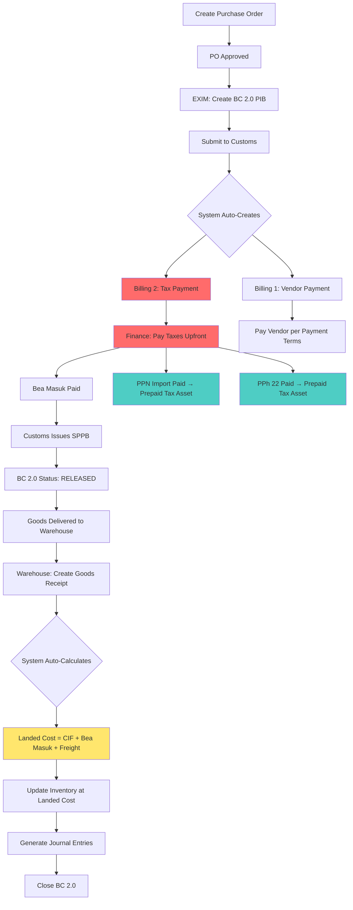

# Product Requirements Document (PRD)
# JKJ Manufacturing ERP - BC 2.0 Regular Import System

> **Document Version**: 1.0
> **Date**: March 9, 2026
> **Author**: Product Team
> **Status**: Draft for Review

---

## 📋 Document Control

| Version | Date | Author | Changes |
|---------|------|--------|---------|
| 1.0 | 2026-03-09 | Product Team | Initial PRD for BC 2.0 System |

---

## 🎯 Executive Summary

### Purpose
This PRD defines the requirements for implementing a **BC 2.0 Regular Import** system for JKJ Manufacturing ERP. Unlike BC 2.3 (bonded zone), BC 2.0 represents standard manufacturing operations with regular customs procedures, requiring **upfront tax payments** but offering **operational flexibility**.

### Business Context
JKJ Manufacturing operates as a **regular manufacturing company** (non-bonded zone) that:
- Imports raw materials (latex, chemicals) with full tax payment upfront
- Manufactures finished goods (gloves)
- Can sell domestically OR export without complex customs traceability
- Faces heavier cash flow burden but lighter customs supervision

### Key Differentiators: BC 2.0 vs BC 2.3

| Aspect | BC 2.0 (Regular) | BC 2.3 (Bonded) |
|--------|------------------|-----------------|
| **Tax Payment** | Upfront (at import) | Deferred (at export) |
| **Cash Flow** | Heavier burden | Lighter burden |
| **Customs Supervision** | Light | Heavy (24/7 monitoring) |
| **Inventory System** | Internal control only | Must connect to Customs IT system |
| **Stock Flexibility** | Full flexibility | Strict tracking, penalties for variance |
| **Sales Destination** | Domestic OR Export freely | Must export to avoid tax |
| **Material Traceability** | Optional (internal) | Mandatory (customs audit) |
| **System Complexity** | Focus on Landed Cost & COGS | Focus on customs compliance |

---

## 🎯 Business Objectives

### Primary Goals
1. **Accurate Landed Cost Calculation** - Capitalize import duties into raw material cost
2. **Proper Tax Accounting** - Track PPN Import (input tax credit) and PPh 22 (prepaid tax)
3. **Correct COGS Calculation** - Ensure HPP includes all landed costs
4. **Operational Flexibility** - Simple inventory management without customs constraints
5. **Dual Billing Management** - Handle vendor payment AND tax payment separately

### Success Metrics
- ✅ 100% accurate landed cost calculation for all imported materials
- ✅ Zero discrepancies in tax accounting (PPN & PPh 22)
- ✅ COGS calculation includes all import duties and freight costs
- ✅ Dual billing process completed within 24 hours of BC 2.0 approval
- ✅ Warehouse operations have full flexibility without customs penalties

---

## 👥 User Personas & Roles

### 1. EXIM Staff (Import Specialist)
**Responsibilities**:
- Process BC 2.0 (PIB - Pemberitahuan Impor Barang)
- Create dual billing: Vendor invoice + Tax billing
- Track customs clearance and tax payment status
- Coordinate with Finance for tax payment

**Pain Points (Current)**:
- Manual calculation of import duties
- Separate tracking of vendor vs tax payments
- No automated landed cost calculation

**Goals**:
- Auto-calculate Bea Masuk, PPN Import, PPh 22
- Single interface to manage dual billing
- Clear visibility of payment status

### 2. Finance/Accounting Staff
**Responsibilities**:
- Process tax payments (Bea Masuk, PPN, PPh 22)
- Record PPN Import as input tax credit
- Record PPh 22 as prepaid tax
- Calculate and record landed cost
- Ensure proper journal entries

**Pain Points (Current)**:
- Manual landed cost capitalization
- Complex tax accounting entries
- Difficult to track prepaid taxes

**Goals**:
- Automated landed cost capitalization to inventory
- Auto-generate tax journal entries
- Clear tracking of tax credits and prepayments

### 3. Purchasing Staff
**Responsibilities**:
- Create Purchase Orders
- Process vendor invoices
- Track payment to overseas vendors

**Pain Points (Current)**:
- Confusion between vendor payment and tax payment
- Unclear total procurement cost

**Goals**:
- Clear separation of vendor vs tax obligations
- Total procurement cost visibility (CIF + duties + freight)

### 4. Warehouse Staff
**Responsibilities**:
- Receive goods after customs clearance
- Record goods receipt with landed cost
- Manage inventory freely without customs constraints

**Pain Points (Current)**:
- Uncertain about final material cost
- Manual stock recording

**Goals**:
- Receive goods with finalized landed cost
- Simple inventory management without customs penalties

### 5. Production Manager
**Responsibilities**:
- Plan production
- Monitor COGS accuracy
- Analyze production efficiency

**Pain Points (Current)**:
- Inaccurate COGS due to missing duty costs
- Difficulty in pricing decisions

**Goals**:
- Accurate COGS including all landed costs
- Better profitability analysis

---

## 📦 Feature Requirements

## Module 1: BC 2.0 Import Management

### 1.1 BC 2.0 Document Creation (`/purchasing/bc20/new`)

**User Story**:
As an EXIM Staff, I want to create a BC 2.0 (PIB) document linked to a Purchase Order, so that I can process regular import customs clearance.

**Functional Requirements**:

**FR-1.1.1: Basic Information**
- Link to existing Purchase Order
- Supplier/Vendor information (auto-filled from PO)
- Port of Entry (dropdown: Tanjung Priok, Tanjung Perak, Belawan, etc.)
- Import date
- Container number / AWB number

**FR-1.1.2: Goods Information**
- Material description (from PO)
- HS Code (Harmonized System Code) - dropdown with search
- Quantity and UOM
- Country of Origin
- Net Weight and Gross Weight

**FR-1.1.3: Value Calculation**
- **FOB Value** (Free on Board - vendor invoice price)
- **Freight Cost** (shipping cost)
- **Insurance Cost**
- **CIF Value** = FOB + Freight + Insurance (auto-calculated)

**FR-1.1.4: Duty Calculation (Auto-calculated)**
- **Bea Masuk** (Import Duty) = CIF × HS Code Duty Rate (e.g., 5%)
- **PPN Import** (Import VAT) = (CIF + Bea Masuk) × 11%
- **PPh 22 Import** = (CIF + Bea Masuk) × PPh Rate (e.g., 2.5% or 7.5% or 10%)
- **Total Duties Payable** = Bea Masuk + PPN Import + PPh 22 Import

**FR-1.1.5: Document Upload**
- Commercial Invoice (mandatory)
- Packing List (mandatory)
- Bill of Lading / Airway Bill (mandatory)
- Certificate of Origin (optional)
- Other supporting documents

**Acceptance Criteria**:
- ✅ BC 2.0 can be created from approved PO
- ✅ All duty calculations are automatic based on HS Code
- ✅ CIF value auto-calculates from FOB + Freight + Insurance
- ✅ System validates all mandatory fields before submission
- ✅ Documents can be uploaded (PDF, JPG, PNG, max 5MB each)

---

### 1.2 Dual Billing Generation

**User Story**:
As an EXIM Staff, I want the system to automatically generate two separate billings when BC 2.0 is submitted, so that I can track vendor payment and tax payment separately.

**Functional Requirements**:

**FR-1.2.1: Vendor Billing (AP Invoice)**
- Auto-create AP Invoice for vendor payment
- Amount: FOB Value + Freight + Insurance = CIF Value
- Payment terms: As per PO (e.g., 30 days from B/L date)
- Currency: USD (or as per PO)
- Payment destination: Vendor's bank account

**FR-1.2.2: Tax Billing (Government Payment)**
- Auto-create Tax Payment record
- Payee: Directorate General of Customs (DJBC)
- Components:
  - Bea Masuk (Import Duty)
  - PPN Import (Import VAT)
  - PPh 22 Import
- Payment deadline: Before goods can be released
- Payment method: Bank transfer to Customs account
- Reference: BC 2.0 / PIB number

**FR-1.2.3: Billing Display**
```
┌─────────────────────────────────────────┐
│ BILLING SUMMARY - BC 2.0: BC20-2026-001 │
├─────────────────────────────────────────┤
│ 1️⃣ VENDOR PAYMENT                       │
│    Payee: ABC Latex Co., Ltd            │
│    Amount: USD 50,000 (CIF)             │
│    Status: PENDING                       │
│    Due: 2026-04-15                      │
├─────────────────────────────────────────┤
│ 2️⃣ TAX PAYMENT (CUSTOMS)                │
│    Payee: DJBC (Customs)                │
│    Bea Masuk:   Rp 5,000,000            │
│    PPN Import:  Rp 6,050,000            │
│    PPh 22:      Rp 1,375,000            │
│    TOTAL:       Rp 12,425,000           │
│    Status: UNPAID (BLOCKING)            │
│    ⚠️ Must pay before customs release    │
└─────────────────────────────────────────┘
```

**Acceptance Criteria**:
- ✅ Two separate billing records created automatically on BC 2.0 submission
- ✅ Vendor billing shows CIF amount in vendor currency
- ✅ Tax billing shows breakdown of all duty components in IDR
- ✅ Both billings linked to BC 2.0 document
- ✅ Payment status tracked separately for each billing

---

### 1.3 BC 2.0 Status Workflow

**Status Flow**:
```
DRAFT → SUBMITTED → UNDER CUSTOMS REVIEW → TAX PAYMENT PENDING →
TAX PAID → CUSTOMS RELEASED → GOODS RECEIVED → CLOSED
```

**Status Definitions**:

| Status | Description | Next Action | Auto-trigger |
|--------|-------------|-------------|--------------|
| **DRAFT** | BC 2.0 being prepared | EXIM staff completes form | - |
| **SUBMITTED** | Submitted to Customs | Wait for customs review | Create dual billing |
| **UNDER CUSTOMS REVIEW** | Customs is reviewing | Wait for tax billing | - |
| **TAX PAYMENT PENDING** | Tax billing issued | Finance must pay taxes | Block goods receipt |
| **TAX PAID** | All taxes paid | Wait for SPPB release | - |
| **CUSTOMS RELEASED** | SPPB received | Warehouse can receive goods | Allow goods receipt |
| **GOODS RECEIVED** | Goods in warehouse | - | Update inventory with landed cost |
| **CLOSED** | Process complete | - | Close all billings |

**Acceptance Criteria**:
- ✅ Status progression follows workflow strictly
- ✅ Goods cannot be received until "CUSTOMS RELEASED" status
- ✅ Tax payment is mandatory before release
- ✅ Auto-notifications sent at each status change

---

## Module 2: Landed Cost Calculation & Capitalization

### 2.1 Landed Cost Components

**User Story**:
As a Finance Staff, I want the system to automatically calculate and capitalize the full landed cost into inventory value, so that COGS reflects the true cost of materials.

**Functional Requirements**:

**FR-2.1.1: Landed Cost Formula**
```
Landed Cost per Unit = (
    CIF Value
    + Bea Masuk (Import Duty)
    + Freight Cost (proportional)
    + Insurance Cost (proportional)
    + Other Costs (handling, storage, etc.)
) / Quantity Received
```

**FR-2.1.2: Cost Components**
- **CIF Value**: FOB + Freight + Insurance (already in vendor invoice)
- **Bea Masuk**: Import Duty (from BC 2.0 calculation)
- **Domestic Freight**: Port to warehouse (if any)
- **Handling Fees**: Port handling, customs broker fees
- **Storage Fees**: If stored at port before pickup

**FR-2.1.3: Exclusions (NOT capitalized)**
- ❌ **PPN Import**: Recorded as prepaid tax (asset), NOT part of inventory cost
- ❌ **PPh 22 Import**: Recorded as prepaid tax (asset), NOT part of inventory cost

**Example Calculation**:
```
Purchase Order: 10,000 kg Latex
FOB Price: USD 50,000
Freight: USD 3,000
Insurance: USD 500
CIF: USD 53,500 (at rate 15,000 = Rp 802,500,000)

Bea Masuk (5%): Rp 40,125,000
Domestic Freight: Rp 5,000,000
Handling Fees: Rp 2,000,000

Landed Cost = Rp 802,500,000 + Rp 40,125,000 + Rp 5,000,000 + Rp 2,000,000
            = Rp 849,625,000

Landed Cost per kg = Rp 849,625,000 / 10,000 kg = Rp 84,962.50 / kg

PPN Import (11%): Rp 92,688,750 → Recorded as Prepaid Tax (Asset)
PPh 22 (2.5%): Rp 21,065,625 → Recorded as Prepaid Tax (Asset)
```

**Acceptance Criteria**:
- ✅ Landed cost includes CIF + Bea Masuk + freight + handling
- ✅ PPN and PPh are NOT included in landed cost
- ✅ Cost per unit auto-calculated based on actual quantity received
- ✅ All costs converted to IDR using official exchange rate

---

### 2.2 Goods Receipt with Landed Cost

**User Story**:
As a Warehouse Staff, I want to receive imported goods with the finalized landed cost already calculated, so that inventory value is accurate from day one.

**Functional Requirements**:

**FR-2.2.1: Goods Receipt Process**
- Link to BC 2.0 document
- Link to Purchase Order
- Can only proceed if BC 2.0 status = "CUSTOMS RELEASED"
- System auto-fills:
  - Material description
  - Ordered quantity
  - **Calculated landed cost per unit**

**FR-2.2.2: Quantity Verification**
- Warehouse inputs actual received quantity
- System shows variance if different from PO/BC 2.0
- If variance > 5%, alert Purchasing Manager

**FR-2.2.3: Inventory Update**
- Add to inventory with **Landed Cost as unit cost**
- Inventory valuation = Quantity × Landed Cost per Unit
- Update stock card with:
  - Date received
  - BC 2.0 reference
  - PO reference
  - Lot/batch number (for traceability)
  - Unit cost (landed)

**FR-2.2.4: Journal Entries (Auto-generated)**
```
DR  Raw Material Inventory          Rp 849,625,000  (Landed Cost)
DR  PPN Prepaid (Tax Asset)         Rp  92,688,750  (PPN Import)
DR  PPh 22 Prepaid (Tax Asset)      Rp  21,065,625  (PPh 22)
    CR  Accounts Payable - Vendor       Rp 802,500,000  (CIF)
    CR  Accounts Payable - Customs      Rp 160,879,375  (Duties)
```

**Acceptance Criteria**:
- ✅ Goods receipt blocked until BC 2.0 is "CUSTOMS RELEASED"
- ✅ Inventory recorded at full landed cost (not just CIF)
- ✅ PPN and PPh recorded as prepaid tax assets, not inventory cost
- ✅ Automatic journal entries created
- ✅ Stock card shows BC 2.0 reference

---

## Module 3: Tax Accounting

### 3.1 PPN Import (Input Tax Credit)

**User Story**:
As a Finance Staff, I want to record PPN Import as an input tax credit, so that it can be offset against PPN Keluaran (output VAT) in monthly tax reporting.

**Functional Requirements**:

**FR-3.1.1: PPN Import Recording**
- Record PPN Import as **Prepaid Tax - PPN** (Current Asset)
- Link to BC 2.0 document
- Amount: (CIF + Bea Masuk) × 11%
- Date: Date of tax payment
- Reference: PIB number

**FR-3.1.2: PPN Crediting**
- PPN Import can be credited against PPN Keluaran (sales VAT) in the same tax period OR future periods
- Track unused PPN credit balance
- Show in monthly VAT report (SPT Masa PPN)

**FR-3.1.3: PPN Report**
```
┌────────────────────────────────────────────┐
│ PPN REPORT - March 2026                    │
├────────────────────────────────────────────┤
│ PPN Keluaran (Output VAT - Sales)          │
│   Total Sales: Rp 500,000,000              │
│   PPN 11%:     Rp  55,000,000              │
├────────────────────────────────────────────┤
│ PPN Masukan (Input VAT - Purchases)        │
│   Domestic Purchases PPN:  Rp 10,000,000   │
│   Import PPN (BC 2.0):     Rp 92,688,750   │
│   Total PPN Masukan:       Rp 102,688,750  │
├────────────────────────────────────────────┤
│ PPN to Pay / (Refund)                      │
│   = Rp 55,000,000 - Rp 102,688,750         │
│   = (Rp 47,688,750) REFUND REQUEST         │
└────────────────────────────────────────────┘
```

**Acceptance Criteria**:
- ✅ PPN Import recorded as asset, not expense
- ✅ Can be credited against PPN Keluaran
- ✅ Unused credit carried forward to next period
- ✅ Integrated with monthly PPN report

---

### 3.2 PPh 22 Import (Prepaid Income Tax)

**User Story**:
As a Finance Staff, I want to record PPh 22 Import as prepaid income tax, so that it can be credited against corporate income tax.

**Functional Requirements**:

**FR-3.2.1: PPh 22 Recording**
- Record PPh 22 Import as **Prepaid Tax - PPh** (Current Asset)
- Link to BC 2.0 document
- Amount: CIF × PPh 22 rate (varies by importer type):
  - 2.5% for importers with API (Importer License)
  - 7.5% for non-API importers
  - 10% for no NPWP
- Date: Date of tax payment
- Reference: PIB number

**FR-3.2.2: PPh 22 Crediting**
- PPh 22 credited against annual corporate income tax (PPh 25/29)
- Track total PPh 22 prepaid for the year
- Show in monthly tax report

**FR-3.2.3: Tax Credit Tracking**
```
┌────────────────────────────────────────────┐
│ PPh 22 PREPAID TAX TRACKING - 2026         │
├────────────────────────────────────────────┤
│ January:  BC20-2026-001   Rp 15,000,000    │
│ February: BC20-2026-002   Rp 21,065,625    │
│ March:    BC20-2026-003   Rp 18,500,000    │
├────────────────────────────────────────────┤
│ Total PPh 22 Prepaid YTD:  Rp 54,565,625   │
│ Available for tax credit                   │
└────────────────────────────────────────────┘
```

**Acceptance Criteria**:
- ✅ PPh 22 recorded as asset, not expense
- ✅ Tracked separately per BC 2.0 document
- ✅ Can be credited against annual income tax
- ✅ YTD balance visible in tax dashboard

---

## Module 4: Purchasing & Procurement

### 4.1 Purchase Order Integration

**User Story**:
As a Purchasing Staff, I want to create a Purchase Order that clearly shows estimated total procurement cost including duties, so that I can budget accurately.

**Functional Requirements**:

**FR-4.1.1: PO Cost Breakdown**
```
┌────────────────────────────────────────────┐
│ PURCHASE ORDER: PO-2026-001                │
├────────────────────────────────────────────┤
│ Vendor: ABC Latex Co., Ltd                 │
│ Material: Natural Latex Concentrate        │
│ Quantity: 10,000 kg                        │
├────────────────────────────────────────────┤
│ COST BREAKDOWN:                            │
│ FOB Price:         USD 50,000              │
│ Freight:           USD  3,000              │
│ Insurance:         USD    500              │
│ ─────────────────────────────              │
│ CIF Total:         USD 53,500              │
│ (@ 15,000):        Rp 802,500,000          │
├────────────────────────────────────────────┤
│ ESTIMATED DUTIES (will finalize in BC 2.0):│
│ Bea Masuk (5%):    Rp  40,125,000          │
│ PPN Import (11%):  Rp  92,688,750          │
│ PPh 22 (2.5%):     Rp  21,065,625          │
│ ─────────────────────────────              │
│ Total Duties:      Rp 153,879,375          │
├────────────────────────────────────────────┤
│ TOTAL PROCUREMENT COST:                    │
│   CIF + Duties:    Rp 956,379,375          │
│                                            │
│ CASH OUT (Taxes):  Rp 153,879,375 (UPFRONT)│
│ CASH OUT (Vendor): Rp 802,500,000 (30 days)│
└────────────────────────────────────────────┘
```

**FR-4.1.2: PO Approval**
- Approval threshold includes estimated total cost (CIF + duties)
- Alert Finance about upcoming tax cash outflow

**Acceptance Criteria**:
- ✅ PO shows estimated duties (will be finalized in BC 2.0)
- ✅ Total procurement cost visible for budgeting
- ✅ Cash flow impact clearly shown (upfront tax vs vendor payment terms)

---

## Module 5: Sales & Export

### 5.1 Flexible Sales Destination

**User Story**:
As a Sales Staff, I want the flexibility to sell finished goods domestically OR export without complex customs procedures, since we use BC 2.0 (not bonded zone).

**Functional Requirements**:

**FR-5.1.1: Domestic Sales**
- Standard sales order process
- Issue Sales Invoice
- Charge PPN Keluaran 11% (Output VAT)
- Issue Faktur Pajak (e-Faktur)
- No customs involvement

**FR-5.1.2: Export Sales (Regular PEB)**
- Create Sales Order for export
- Create regular PEB (Pemberitahuan Ekspor Barang)
- **No need to link to BC 2.0 import** (unlike BC 2.3)
- **No material traceability requirement** for customs
- Export is VAT zero-rated (no PPN charged)
- Standard export documents: Commercial Invoice, Packing List, COO

**FR-5.1.3: Key Difference from BC 2.3**
```
BC 2.0 (Regular):
✅ Can sell domestic or export freely
✅ No mandatory traceability BC 2.0 → PEB
✅ Simple export process
✅ PEB is just export declaration, not linked to import

BC 2.3 (Bonded):
❌ Must export (selling domestic requires paying deferred duties)
❌ Mandatory traceability BC 2.3 → BC 3.0
❌ Complex conversion analysis required
❌ BC 3.0 must reconcile with BC 2.3 imports
```

**Acceptance Criteria**:
- ✅ Sales orders can be domestic or export
- ✅ Export PEB is simple, not linked to BC 2.0
- ✅ No material traceability required for customs
- ✅ PPN handling correct: 11% domestic, 0% export

---

## Module 6: Inventory Management

### 6.1 Simplified Inventory Control

**User Story**:
As a Warehouse Manager, I want full flexibility to manage inventory without customs constraints, since BC 2.0 doesn't require real-time customs monitoring.

**Functional Requirements**:

**FR-6.1.1: No Customs IT System Integration**
- ❌ No need to connect to Customs IT Inventory system
- ❌ No real-time reporting to customs
- ❌ No penalties for stock variances (unlike BC 2.3)

**FR-6.1.2: Internal Control Only**
- Stock movements tracked for internal costing and control
- Goods Receipt (from BC 2.0 import)
- Material consumption (to production)
- Finished goods receipt (from production)
- Sales/delivery (domestic or export)
- Stock adjustments (waste, scrap, theft, etc.)

**FR-6.1.3: Optional Material Traceability**
- Lot/batch tracking for **quality control purposes** (internal)
- Not mandatory for customs compliance
- Can implement if needed for ISO certification or customer requirements

**FR-6.1.4: Stock Flexibility**
```
BC 2.0 Operations:
✅ Free to adjust stock for waste/scrap without customs approval
✅ Can transfer materials between locations freely
✅ Stock count variance doesn't trigger customs audit
✅ Rejection/rework handled as internal process
```

**Acceptance Criteria**:
- ✅ Inventory system is for internal control only
- ✅ No customs IT system connection required
- ✅ Stock adjustments don't require customs approval
- ✅ Material traceability optional, not mandatory

---

## Module 7: COGS & Production Costing

### 7.1 Landed Cost in COGS

**User Story**:
As a Production Manager, I want the COGS to include the full landed cost of imported materials, so that profitability analysis is accurate.

**Functional Requirements**:

**FR-7.1.1: Material Cost in BOM**
- Bill of Materials (BOM) uses **landed cost** as material cost
- Example: If BOM requires 1 kg latex per 100 gloves
  - Latex landed cost: Rp 84,962.50 / kg
  - Material cost per 100 gloves: Rp 84,962.50

**FR-7.1.2: COGS Calculation**
```
COGS per 100 gloves:
  Raw Material (at landed cost):  Rp  84,962.50
  Direct Labor:                   Rp  25,000.00
  Factory Overhead:               Rp  15,000.00
  ──────────────────────────────
  Total COGS per 100 gloves:      Rp 124,962.50
  COGS per piece:                 Rp   1,249.63
```

**FR-7.1.3: Impact on Pricing**
- Sales price must cover landed cost COGS
- Profitability analysis uses accurate COGS
- Landed cost makes domestic sales more expensive (vs BC 2.3)

**FR-7.1.4: Cost Variance Analysis**
- Track landed cost variance over time
- Alert if duties or freight costs increase significantly
- Help procurement negotiate better terms

**Acceptance Criteria**:
- ✅ BOM material cost uses landed cost (not just FOB)
- ✅ COGS includes all import duties capitalized in raw material
- ✅ Profitability reports show accurate margins
- ✅ Cost variance tracking available

---

## 📊 Reports & Analytics

### 8.1 Required Reports

**R-1: BC 2.0 Import Summary**
- List of all BC 2.0 documents by period
- Status tracking
- Total CIF value
- Total duties paid
- Total materials received

**R-2: Landed Cost Analysis**
- Material-wise landed cost breakdown
- Components: FOB, Freight, Insurance, Bea Masuk, Other
- Cost per unit trend over time
- Variance analysis

**R-3: Tax Payment Tracking**
- PPN Import paid and credited
- PPh 22 paid and credited
- Outstanding tax credits
- Monthly PPN reconciliation

**R-4: Cash Flow Impact**
- Upcoming tax payments (BC 2.0 pending)
- Vendor payments due
- Total procurement cash outflow forecast

**R-5: COGS Analysis**
- Material cost breakdown (landed cost)
- COGS trend over time
- Profitability by product with accurate COGS

**R-6: Dual Billing Status**
- Vendor payment status
- Tax payment status
- Outstanding amounts by BC 2.0

---

## 🔄 System Workflow

### End-to-End Import Process Flow



### Key Differences from Current BC 2.3 Flow

| Step | BC 2.3 (Bonded) | BC 2.0 (Regular) |
|------|-----------------|------------------|
| **Tax Payment** | Deferred until export | **Upfront at import** |
| **Billing** | Single vendor billing | **Dual billing: Vendor + Tax** |
| **Inventory Cost** | FOB/CIF value only | **Landed cost (CIF + duties)** |
| **PPN & PPh** | Deferred/exempted | **Prepaid tax assets** |
| **Material Traceability** | Mandatory for customs | **Optional (internal only)** |
| **Export Requirement** | Must export to avoid tax | **No export obligation** |
| **Customs Monitoring** | Real-time IT system | **No real-time monitoring** |

---

## 🎨 User Interface Requirements

### UI-1: BC 2.0 Creation Form

**Layout**:
```
┌────────────────────────────────────────────────────────┐
│ Create BC 2.0 (PIB) - Regular Import                   │
├────────────────────────────────────────────────────────┤
│ 📋 Basic Information                                   │
│   • Link to PO: [Dropdown: PO-2026-001 ▼]             │
│   • Supplier: ABC Latex Co. (auto-filled)             │
│   • Port of Entry: [Tanjung Priok ▼]                  │
│   • Import Date: [2026-03-15 📅]                       │
│   • Container No: ABCU1234567                          │
├────────────────────────────────────────────────────────┤
│ 📦 Goods Information                                   │
│   • Material: Natural Latex (auto-filled)             │
│   • HS Code: [3920.10.00 🔍] (search)                 │
│   • Quantity: 10,000 kg                               │
│   • Net Weight: 10,000 kg                             │
│   • Gross Weight: 10,500 kg                           │
│   • Country of Origin: [Thailand ▼]                   │
├────────────────────────────────────────────────────────┤
│ 💰 Value Information                                   │
│   FOB Value:        USD 50,000.00                     │
│   Freight Cost:     USD  3,000.00                     │
│   Insurance:        USD    500.00                     │
│   ────────────────────────────────                    │
│   CIF Value:        USD 53,500.00                     │
│   Exchange Rate:    15,000                            │
│   CIF (IDR):        Rp 802,500,000                    │
├────────────────────────────────────────────────────────┤
│ 📊 Duty Calculation (Auto)                             │
│   HS Code Duty Rate: 5% (Bea Masuk)                  │
│   ────────────────────────────────                    │
│   Bea Masuk (5%):      Rp  40,125,000                │
│   Base for PPN:        Rp 842,625,000                │
│   PPN Import (11%):    Rp  92,688,750                │
│   PPh 22 (2.5%):       Rp  21,065,625                │
│   ────────────────────────────────                    │
│   Total Duties:        Rp 153,879,375 ⚠️ Pay Upfront  │
├────────────────────────────────────────────────────────┤
│ 📎 Documents                                           │
│   [Upload Commercial Invoice] ✅ invoice.pdf           │
│   [Upload Packing List] ✅ packing.pdf                 │
│   [Upload Bill of Lading] ✅ bl.pdf                    │
│   [Upload Certificate of Origin] ✅ coo.pdf            │
├────────────────────────────────────────────────────────┤
│           [Cancel]  [Save Draft]  [Submit to Customs]  │
└────────────────────────────────────────────────────────┘
```

---

### UI-2: Dual Billing Display

**Layout**:
```
┌────────────────────────────────────────────────────────┐
│ BC 2.0 Detail: BC20-2026-001                           │
│ Status: TAX PAYMENT PENDING ⚠️                         │
├────────────────────────────────────────────────────────┤
│ 💵 BILLING SUMMARY                                     │
├────────────────────────────────────────────────────────┤
│ 1️⃣ VENDOR PAYMENT                                      │
│    ┌──────────────────────────────────────────────┐   │
│    │ Payee: ABC Latex Co., Ltd                    │   │
│    │ Invoice: INV-TH-2026-0015                    │   │
│    │ Amount: USD 53,500.00                        │   │
│    │         (Rp 802,500,000 @ 15,000)            │   │
│    │ Payment Terms: 30 days from B/L              │   │
│    │ Due Date: 2026-04-15                         │   │
│    │ Status: 🟡 PENDING                            │   │
│    │ [Record Payment]                             │   │
│    └──────────────────────────────────────────────┘   │
├────────────────────────────────────────────────────────┤
│ 2️⃣ TAX PAYMENT (CUSTOMS) ⚠️ BLOCKING                   │
│    ┌──────────────────────────────────────────────┐   │
│    │ Payee: DJBC (Directorate General Customs)   │   │
│    │ Reference: PIB BC20-2026-001                 │   │
│    │                                              │   │
│    │ Bea Masuk (5%):       Rp  40,125,000        │   │
│    │ PPN Import (11%):     Rp  92,688,750        │   │
│    │ PPh 22 (2.5%):        Rp  21,065,625        │   │
│    │ ─────────────────────────────────           │   │
│    │ TOTAL TAX PAYABLE:    Rp 153,879,375        │   │
│    │                                              │   │
│    │ Payment Deadline: IMMEDIATE (before release)│   │
│    │ Status: 🔴 UNPAID - BLOCKING GOODS RELEASE   │   │
│    │                                              │   │
│    │ ⚠️ Goods cannot be released until paid       │   │
│    │ [Record Tax Payment]                         │   │
│    └──────────────────────────────────────────────┘   │
└────────────────────────────────────────────────────────┘
```

---

### UI-3: Goods Receipt with Landed Cost

**Layout**:
```
┌────────────────────────────────────────────────────────┐
│ Create Goods Receipt                                   │
├────────────────────────────────────────────────────────┤
│ 📋 Reference Documents                                 │
│   • BC 2.0: BC20-2026-001 ✅ CUSTOMS RELEASED          │
│   • PO: PO-2026-001                                   │
│   • Supplier: ABC Latex Co.                           │
├────────────────────────────────────────────────────────┤
│ 📦 Material & Quantity                                 │
│   Material: Natural Latex Concentrate                 │
│   Ordered Qty: 10,000 kg                              │
│   Received Qty: [9,950 kg] ⚠️ -50 kg variance          │
│   Lot/Batch: [LAT-2026-03-001]                        │
├────────────────────────────────────────────────────────┤
│ 💰 Landed Cost Calculation                             │
│   ┌──────────────────────────────────────────────┐   │
│   │ CIF Value:         Rp 802,500,000            │   │
│   │ Bea Masuk (5%):    Rp  40,125,000            │   │
│   │ Freight (domestic): Rp   5,000,000            │   │
│   │ Handling Fees:     Rp   2,000,000            │   │
│   │ ─────────────────────────────────           │   │
│   │ Total Landed Cost: Rp 849,625,000            │   │
│   │                                              │   │
│   │ Received Qty: 9,950 kg                       │   │
│   │ Unit Cost:    Rp 85,389.95 / kg              │   │
│   └──────────────────────────────────────────────┘   │
│                                                        │
│   ℹ️ PPN & PPh NOT included in inventory cost         │
│   PPN Import (Rp 92,688,750) → Prepaid Tax Asset     │
│   PPh 22 (Rp 21,065,625) → Prepaid Tax Asset         │
├────────────────────────────────────────────────────────┤
│ 📸 Documentation                                       │
│   [Upload Photos] 📷                                   │
│   [Upload Delivery Note]                              │
├────────────────────────────────────────────────────────┤
│           [Cancel]  [Save Draft]  [Complete Receipt]   │
└────────────────────────────────────────────────────────┘
```

---

## 🔐 Security & Permissions

### Permission Matrix

| Role | BC 2.0 Create | BC 2.0 Submit | Tax Payment | Vendor Payment | Goods Receipt | View Reports |
|------|---------------|---------------|-------------|----------------|---------------|--------------|
| **EXIM Staff** | ✅ | ✅ | ❌ | ❌ | ❌ | ✅ |
| **Purchasing** | ✅ | ❌ | ❌ | ❌ | ❌ | ✅ |
| **Finance Staff** | ❌ | ❌ | ✅ | ✅ | ❌ | ✅ |
| **Finance Manager** | ❌ | ✅ Approve | ✅ Approve | ✅ Approve | ❌ | ✅ |
| **Warehouse Staff** | ❌ | ❌ | ❌ | ❌ | ✅ | ✅ |
| **Warehouse Manager** | ❌ | ❌ | ❌ | ❌ | ✅ Approve | ✅ |
| **Director** | ✅ | ✅ | ✅ | ✅ | ✅ | ✅ |

---

## 🧪 Testing Requirements

### Test Scenarios

**TS-1: BC 2.0 Creation & Duty Calculation**
- Create BC 2.0 from approved PO
- Verify auto-calculation of Bea Masuk, PPN, PPh 22
- Verify CIF calculation (FOB + Freight + Insurance)
- Submit and verify dual billing creation

**TS-2: Dual Billing Generation**
- Verify vendor billing created with CIF amount
- Verify tax billing created with duty breakdown
- Verify both linked to BC 2.0

**TS-3: Tax Payment Blocking**
- Attempt to receive goods before tax payment
- Verify system blocks goods receipt
- Record tax payment
- Verify status changes to "CUSTOMS RELEASED"
- Verify goods receipt now allowed

**TS-4: Landed Cost Calculation**
- Receive goods after customs release
- Verify landed cost = CIF + Bea Masuk + freight + handling
- Verify PPN and PPh excluded from landed cost
- Verify inventory updated at landed cost

**TS-5: Tax Accounting**
- Verify PPN recorded as prepaid tax asset
- Verify PPh 22 recorded as prepaid tax asset
- Verify not expensed or capitalized to inventory

**TS-6: COGS Calculation**
- Create production work order
- Verify BOM uses landed cost for materials
- Verify COGS includes landed cost components

**TS-7: Domestic Sales**
- Create domestic sales order
- Verify PPN 11% charged
- Verify Faktur Pajak generated

**TS-8: Export Sales (Regular)**
- Create export sales order
- Verify PEB created (not BC 3.0)
- Verify no link to BC 2.0 required
- Verify zero-rated VAT

---

## 📅 Implementation Timeline

### Phase 1: Foundation (Weeks 1-2)
- Database schema for BC 2.0
- BC 2.0 creation form with duty calculation
- Dual billing logic
- Status workflow

### Phase 2: Tax & Accounting (Weeks 3-4)
- Landed cost calculation engine
- Tax payment recording (PPN, PPh 22)
- Journal entry automation
- Goods receipt with landed cost

### Phase 3: Integration (Weeks 5-6)
- PO integration
- Inventory update with landed cost
- COGS calculation with landed cost
- Sales module (domestic & export)

### Phase 4: Reporting (Week 7)
- BC 2.0 summary report
- Landed cost analysis
- Tax tracking reports
- Cash flow forecast

### Phase 5: Testing & UAT (Week 8)
- End-to-end testing
- User acceptance testing
- Bug fixes
- Documentation

---

## 📚 Appendix

### A. Glossary

| Term | Definition |
|------|------------|
| **BC 2.0 (PIB)** | Regular import customs declaration (Pemberitahuan Impor Barang) |
| **BC 2.3** | Bonded zone import declaration (not applicable for this system) |
| **CIF** | Cost, Insurance, Freight - total landed value at port |
| **FOB** | Free on Board - price of goods at origin port |
| **Bea Masuk** | Import Duty |
| **PPN Import** | Import Value Added Tax (11%) |
| **PPh 22** | Withholding income tax on import (2.5%-10%) |
| **SPPB** | Customs release approval (Surat Persetujuan Pengeluaran Barang) |
| **Landed Cost** | Total cost of imported goods including CIF + duties + freight |
| **COGS** | Cost of Goods Sold |
| **PEB** | Regular export declaration (Pemberitahuan Ekspor Barang) |

### B. Duty Rates Reference

**Bea Masuk (Import Duty)**:
- Varies by HS Code
- Example: 3920.10.00 (Latex) = 5%

**PPN Import (Import VAT)**:
- Standard rate: 11% of (CIF + Bea Masuk)

**PPh 22 Import**:
- With API (import license): 2.5%
- Without API: 7.5%
- No NPWP (tax ID): 10%
- Base: CIF value (not including Bea Masuk)

### C. Tax Credit Rules

**PPN Import**:
- Can be credited against PPN Keluaran (output VAT)
- Creditable in the same month or carried forward
- Recorded as asset until credited

**PPh 22 Import**:
- Credited against annual corporate income tax (PPh 29)
- Recorded as asset until year-end tax calculation

---

## ✅ Acceptance Criteria Summary

This BC 2.0 system will be considered complete when:

- ✅ BC 2.0 (PIB) can be created with auto-calculated duties (Bea Masuk, PPN, PPh 22)
- ✅ Dual billing automatically generated (vendor + tax)
- ✅ Tax payment blocks goods receipt until paid
- ✅ Landed cost automatically calculated and capitalized to inventory
- ✅ PPN and PPh 22 recorded as prepaid tax assets (not inventory cost)
- ✅ Goods receipt updates inventory at landed cost
- ✅ COGS calculation includes landed cost
- ✅ Domestic sales charge PPN 11% correctly
- ✅ Export sales use regular PEB (not BC 3.0) without import linkage
- ✅ All reports available (BC summary, landed cost, tax tracking, cash flow)

---

**Document Status**: Ready for Review
**Next Steps**: Review with stakeholders → Approval → Implementation

**© 2026 JKJ Manufacturing ERP**
_Product Requirements Document - BC 2.0 Regular Import System_
