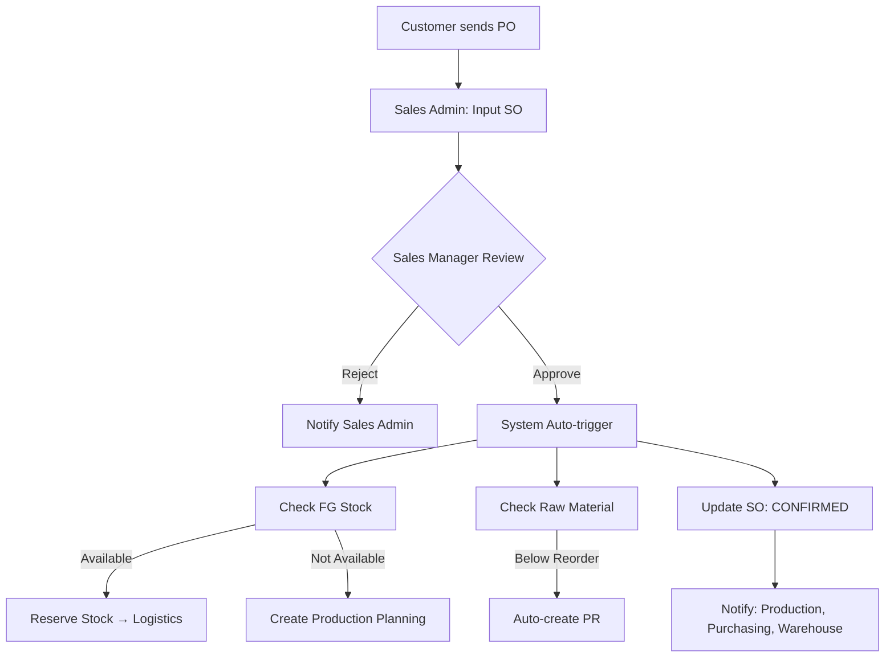
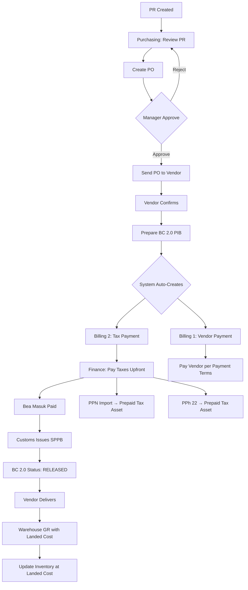
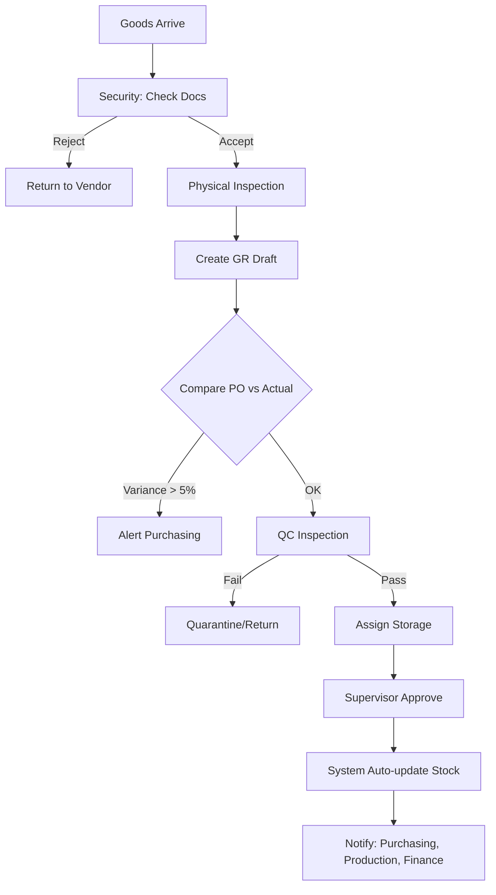
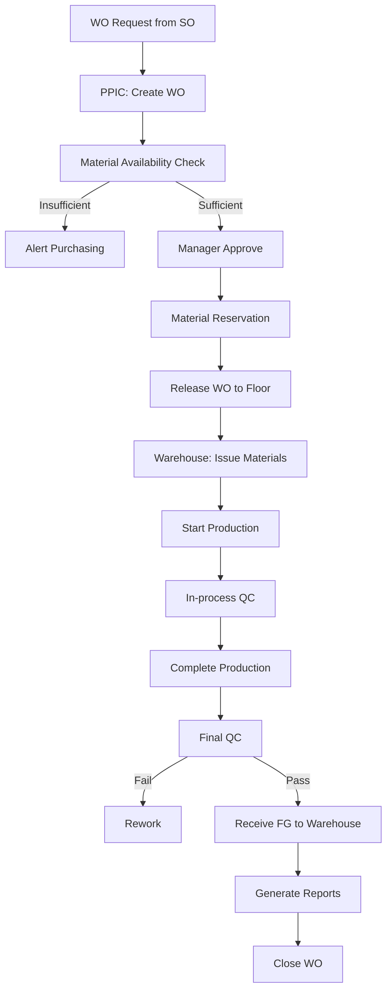
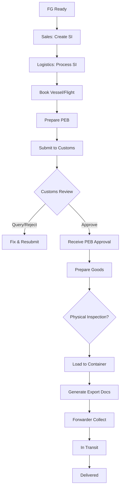
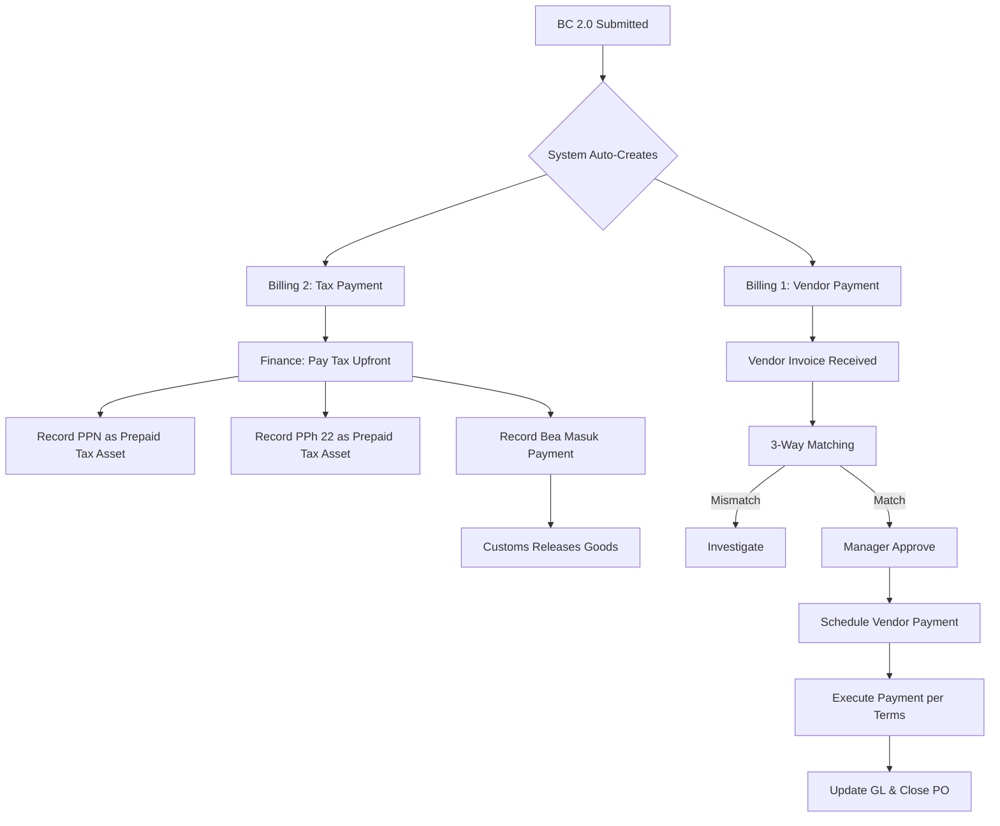
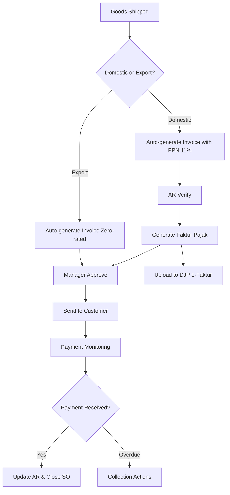

# Detailed Workflow Specifications

> **Source**: User-provided comprehensive workflow documentation
> **Date**: 2026-02-05

## Overview

This document captures the complete end-to-end workflow specifications for the ERP system, covering all modules from Sales Order to Finance, including customs compliance (BC 2.0 Regular Import and PEB Regular Export).

---

## A. Sales Order Workflow

### Process Flow


```mermaid
graph TD
    A[Customer sends PO] --> B[Sales Admin: Input SO]
    B --> C{Sales Manager Review}
    C -->|Reject| D[Notify Sales Admin]
    C -->|Approve| E[System Auto-trigger]
    E --> F[Check FG Stock]
    E --> G[Check Raw Material]
    E --> H[Update SO: CONFIRMED]
    F -->|Available| I[Reserve Stock → Logistics]
    F -->|Not Available| J[Create Production Planning]
    G -->|Below Reorder| K[Auto-create PR]
    H --> L[Notify: Production, Purchasing, Warehouse]
```

### Status Flow

`DRAFT` → `PENDING APPROVAL` → `APPROVED` → `IN PRODUCTION` → `READY TO SHIP` → `COMPLETED`

### Key Fields

- Customer, Product, Quantity, Delivery Date
- PO Document Upload
- Credit Limit Check
- Stock Availability Check

### Auto-triggers

- FG Stock check → Reserve or Create WO
- Raw Material check → Create PR if below reorder point
- Notifications to Production, Purchasing, Warehouse

---

## B. Purchasing & BC 2.0 (Regular Import) Workflow

### Process Flow


```mermaid
graph TD
    A[PR Created] --> B[Purchasing: Review PR]
    B --> C[Create PO]
    C --> D{Manager Approve}
    D -->|Reject| B
    D -->|Approve| E[Send PO to Vendor]
    E --> F[Vendor Confirms]
    F --> G[Prepare BC 2.0 PIB]
    G --> H{System Auto-Creates}
    H --> I[Billing 1: Vendor Payment]
    H --> J[Billing 2: Tax Payment]
    J --> K[Finance: Pay Taxes Upfront]
    K --> L[Bea Masuk Paid]
    K --> M[PPN Import → Prepaid Tax Asset]
    K --> N[PPh 22 → Prepaid Tax Asset]
    L --> O[Customs Issues SPPB]
    O --> P[BC 2.0 Status: RELEASED]
    P --> Q[Vendor Delivers]
    Q --> R[Warehouse GR with Landed Cost]
    R --> S[Update Inventory at Landed Cost]
    I --> T[Pay Vendor per Payment Terms]
```

### BC 2.0 Status Flow

`DRAFT` → `SUBMITTED` → `UNDER CUSTOMS REVIEW` → `TAX PAYMENT PENDING` → `TAX PAID` → `CUSTOMS RELEASED` → `GOODS RECEIVED` → `CLOSED`

### PO Status Flow

`DRAFT` → `PENDING APPROVAL` → `APPROVED` → `SENT TO VENDOR` → `PARTIALLY RECEIVED` → `COMPLETED`

### Key Documents

- Commercial Invoice, Packing List, B/L
- HS Code, Origin, Value
- Duties & Taxes calculation (Bea Masuk, PPN Import, PPh 22)
- SPPB (Surat Persetujuan Pengeluaran Barang)

### Implementation Features ✅

**BC 2.0 Management** (`/purchasing/bc20`)

- Dashboard with stats (Pending, Tax Payment Pending, Total Value)
- Dual billing status tracking
- List view with status badges
- Search and filter capabilities
- Quick navigation to detail pages

**BC 2.0 Detail Page** (`/purchasing/bc20/[id]`)

- Complete document information (BC number, PO reference, Supplier)
- Goods details with HS Code
- **Dual Billing Display**: Vendor Payment + Tax Payment
- Duty calculations breakdown (Bea Masuk, PPN, PPh 22)
- **Landed Cost Calculation**: CIF + Bea Masuk + Freight
- SPPB tracking
- Document checklist (Invoice, Packing List, B/L, COO)
- Status timeline visualization
- Activity log with audit trail
- **Lot Number Assignment** for optional internal traceability

### Critical Data Points

- **Lot Number**: Assigned at import for optional internal traceability (e.g., `RM-2026-001`)
- **HS Code**: Required for duty calculation
- **CIF Value**: FOB + Freight + Insurance (basis for customs duties)
- **Duty Breakdown**:
  - Bea Masuk (capitalized to inventory)
  - PPN Import (prepaid tax asset, NOT inventory cost)
  - PPh 22 (prepaid tax asset, NOT inventory cost)
- **Landed Cost**: CIF + Bea Masuk + Freight + Handling (inventory value)
- **SPPB Number**: Customs clearance approval reference
- **Dual Billing**: Separate tracking for vendor payment and tax payment

---

## C. Warehouse Receiving (GR) Workflow

### Process Flow


```mermaid
graph TD
    A[Goods Arrive] --> B[Security: Check Docs]
    B -->|Reject| C[Return to Vendor]
    B -->|Accept| D[Physical Inspection]
    D --> E[Create GR Draft]
    E --> F{Compare PO vs Actual}
    F -->|Variance > 5%| G[Alert Purchasing]
    F -->|OK| H[QC Inspection]
    H -->|Fail| I[Quarantine/Return]
    H -->|Pass| J[Assign Storage]
    J --> K[Supervisor Approve]
    K --> L[System Auto-update Stock]
    L --> M[Notify: Purchasing, Production, Finance]
```

### Status Flow

`PENDING ARRIVAL` → `DRAFT GR` → `QC INSPECTION` → `APPROVED` → `STOCK UPDATED`

### Key Actions

- Physical count, quality check, weighing
- Photo documentation
- BC 2.0 verification (for imports)
- **Landed cost calculation**: System auto-calculates CIF + Bea Masuk + Freight
- **Inventory valuation**: Update stock at landed cost (not just CIF)
- **Tax asset recording**: PPN & PPh 22 as prepaid tax (NOT inventory cost)
- 3-way matching trigger (PO-GR-Invoice)
- Stock card update with landed cost, Laporan Mutasi Stok

---

## D. Production Workflow

### Process Flow


```mermaid
graph TD
    A[WO Request from SO] --> B[PPIC: Create WO]
    B --> C[Material Availability Check]
    C -->|Insufficient| D[Alert Purchasing]
    C -->|Sufficient| E[Manager Approve]
    E --> F[Material Reservation]
    F --> G[Release WO to Floor]
    G --> H[Warehouse: Issue Materials]
    H --> I[Start Production]
    I --> J[In-process QC]
    J --> K[Complete Production]
    K --> L[Final QC]
    L -->|Fail| M[Rework]
    L -->|Pass| N[Receive FG to Warehouse]
    N --> O[Generate Reports]
    O --> P[Close WO]
```

### Status Flow

`DRAFT` → `APPROVED` → `MATERIAL RESERVED` → `RELEASED` → `IN PROGRESS` → `COMPLETED` → `QC PASS` → `FG RECEIVED` → `CLOSED`

### Key Reports Auto-generated

1. **Laporan Hasil Produksi**
   - Target vs Actual output
   - Efficiency metrics
   - Quality metrics

2. **Konversi Bahan Baku Report** (`/reports/production`)
   - Raw material consumed (with optional BC 2.0 reference)
   - Finished goods produced (with lot number)
   - Conversion ratio (actual vs standard)
   - Variance analysis (standard vs actual)
   - Waste/scrap tracking
   - **Optional Traceability**: BC 2.0 (import) → GR → WO → FG → PEB (export)

### Material Traceability System (Optional)

**Note**: Unlike BC 2.3 bonded zone operations, BC 2.0 regular import does NOT require mandatory customs traceability. However, the system can optionally track material flow for:
- Internal quality control
- ISO certification requirements
- Customer-specific documentation needs
- Production efficiency analysis

**Optional Traceability Chain** (`/reports/traceability`)

- Visual flow: BC 2.0 → Goods Receipt → Work Order → Finished Goods → PEB
- Lot/batch tracking throughout the chain (if enabled)
- Conversion analysis with variance
- Material Traceability Certificate generation (for customers)
- Search by: Lot Number, BC 2.0, PEB, WO, PO

**Key Traceability Data** (if tracked):

- RM Lot Number (from BC 2.0): `RM-2026-001`
- FG Lot Number (from WO): `FG-2026-001`
- Conversion Ratio: Actual vs Standard
- Variance %: Performance indicator
- Waste Quantity: For internal control (not customs compliance)

---

## E. Logistics & PEB (Regular Export) Workflow

### Process Flow


```mermaid
graph TD
    A[FG Ready] --> B[Sales: Create SI]
    B --> C[Logistics: Process SI]
    C --> D[Book Vessel/Flight]
    D --> E[Prepare PEB]
    E --> F[Submit to Customs]
    F --> G{Customs Review}
    G -->|Query/Reject| H[Fix & Resubmit]
    G -->|Approve| I[Receive PEB Approval]
    I --> J[Prepare Goods]
    J --> K{Physical Inspection?}
    K --> L[Load to Container]
    L --> M[Generate Export Docs]
    M --> N[Forwarder Collect]
    N --> O[In Transit]
    O --> P[Delivered]
```

### PEB Status Flow

`DRAFT` → `SUBMITTED` → `UNDER REVIEW` → `APPROVED` → `EXPORTED` → `CLOSED`

### Shipment Status Flow

`DRAFT SI` → `CONFIRMED` → `PEB SUBMITTED` → `PEB APPROVED` → `LOADED` → `IN TRANSIT` → `DELIVERED` → `COMPLETED`

### Key Documents

- Commercial Invoice, Packing List
- Certificate of Origin (Form E, etc)
- Health Certificate
- PEB (Pemberitahuan Ekspor Barang)
- NPE (Nomor Pendaftaran Eksportir)
- Bill of Lading / Airway Bill
- POD (Proof of Delivery)

### Implementation Features ✅

**PEB Management** (`/logistics/peb`)

- Dashboard with stats (Pending, Approved, Total Export Value)
- List view with PEB tracking
- Status badges and filters
- Quick access to detail pages

**PEB Detail Page** (`/logistics/peb/[id]`)

- Complete export declaration information
- PEB (Pemberitahuan Ekspor Barang) tracking
- NPE (Nomor Pendaftaran Eksportir) display
- **No mandatory BC 2.0 linkage required** (operational flexibility)
- **Optional Traceability**: Can link to WO for internal tracking
- Document checklist (Invoice, Packing List, COO, Health Cert, Form E)
- Status timeline
- Activity log

### Key Differences from BC 3.0 (Bonded Zone Export)

**BC 2.0 Regular Import System**:

- ✅ Can sell domestic or export freely
- ✅ No mandatory traceability BC 2.0 → PEB
- ✅ Simple export process (PEB is just export declaration)
- ✅ PEB is NOT linked to import documents
- ✅ No conversion analysis required for customs
- ✅ Optional internal traceability for quality/ISO purposes

**Stock Movement Report** ✅ (`/reports/stock-movement`)

- Period & material filters
- Balance summary (Opening, In, Out, Closing)
- Transaction breakdown by type:
  - Import (BC 2.0 references)
  - Production (WO references)
  - Export (PEB references)
  - Domestic Sales
  - Waste/Scrap
- Detailed transaction table with optional lot tracking
- BC 2.0/PEB references for all movements
- Export to Excel functionality

---

## F. Finance Workflow

### Accounts Payable (AP) - Dual Billing System


```mermaid
graph TD
    A[BC 2.0 Submitted] --> B{System Auto-Creates}
    B --> C[Billing 1: Vendor Payment]
    B --> D[Billing 2: Tax Payment]
    D --> E[Finance: Pay Tax Upfront]
    E --> F[Record PPN as Prepaid Tax Asset]
    E --> G[Record PPh 22 as Prepaid Tax Asset]
    E --> H[Record Bea Masuk Payment]
    H --> I[Customs Releases Goods]
    C --> J[Vendor Invoice Received]
    J --> K[3-Way Matching]
    K -->|Mismatch| L[Investigate]
    K -->|Match| M[Manager Approve]
    M --> N[Schedule Vendor Payment]
    N --> O[Execute Payment per Terms]
    O --> P[Update GL & Close PO]
```

### Accounts Receivable (AR)


```mermaid
graph TD
    A[Goods Shipped] --> B{Domestic or Export?}
    B -->|Domestic| C[Auto-generate Invoice with PPN 11%]
    B -->|Export| D[Auto-generate Invoice Zero-rated]
    C --> E[AR Verify]
    E --> F[Generate Faktur Pajak]
    F --> G[Manager Approve]
    D --> G
    G --> H[Send to Customer]
    F --> I[Upload to DJP e-Faktur]
    H --> J[Payment Monitoring]
    J --> K{Payment Received?}
    K -->|Yes| L[Update AR & Close SO]
    K -->|Overdue| M[Collection Actions]
```

### Invoice Status Flow

`DRAFT` → `APPROVED` → `SENT` → `PARTIALLY PAID` → `PAID` / `OVERDUE`

### Tax Accounting Features

**PPN Import (Input Tax Credit)**:
- Record as Prepaid Tax - PPN (Current Asset)
- Credit against PPN Keluaran (Output VAT)
- Track unused credit balance
- Monthly PPN reconciliation report

**PPh 22 Import (Prepaid Income Tax)**:
- Record as Prepaid Tax - PPh (Current Asset)
- Credit against annual corporate income tax
- Year-to-date tracking
- Tax credit utilization report

**Journal Entries (Auto-generated on GR)**:
```
DR  Raw Material Inventory (Landed Cost)
DR  PPN Prepaid (Tax Asset)
DR  PPh 22 Prepaid (Tax Asset)
    CR  Accounts Payable - Vendor (CIF)
    CR  Accounts Payable - Customs (Duties)
```

---

## G. Integration & Auto-triggers

### Cross-Module Triggers

| Trigger Event       | Auto Actions                                                                                                                                            |
| :------------------ | :------------------------------------------------------------------------------------------------------------------------------------------------------ |
| **SO APPROVED**     | Check FG Stock → Reserve or Create WO<br>Check Raw Material → Create PR if low<br>Update Sales Dashboard                                                |
| **PO APPROVED**     | Notify Warehouse for GR prep<br>Create BC 2.0 template (imports)<br>Update Purchasing Dashboard                                                         |
| **BC 2.0 SUBMITTED**| **Auto-create dual billing**: Vendor Payment + Tax Payment<br>Alert Finance: Upfront tax payment required<br>Block goods receipt until tax paid         |
| **TAX PAID**        | Update BC 2.0 status to TAX PAID<br>Record PPN Import as prepaid tax asset<br>Record PPh 22 as prepaid tax asset<br>Wait for SPPB from customs          |
| **BC 2.0 RELEASED** | Notify Warehouse: Ready to receive<br>Allow GR creation<br>Update Compliance Dashboard                                                                  |
| **GR COMPLETED**    | **Capitalize landed cost to inventory** (CIF + Bea Masuk + Freight)<br>Update Inventory at landed cost<br>Notify Production: Material available<br>Trigger AP: Invoice matching<br>Generate Laporan Mutasi Stok |
| **WO COMPLETED**    | Update FG Inventory<br>Generate Production Reports<br>Generate Konversi Bahan Baku (optional)<br>Notify Logistics<br>Update SO status                   |
| **PEB APPROVED**    | Allow shipment<br>Generate export documents<br>Update Compliance Dashboard                                                                              |
| **GOODS SHIPPED**   | Update FG Stock<br>Auto-generate Sales Invoice<br>Update SO: SHIPPED<br>Start shipment tracking                                                         |
| **INVOICE CREATED** | Generate Faktur Pajak (domestic only)<br>Schedule email to customer<br>Start payment monitoring<br>Update AR Dashboard                                  |

---

## H. Approval Matrix

| Document             | Level 1              | Level 2               | Level 3                       | Level 4          |
| :------------------- | :------------------- | :-------------------- | :---------------------------- | :--------------- |
| **Sales Order**      | Sales Admin (Create) | Sales Manager (>50M)  | Director (>500M)              | -                |
| **Purchase Request** | Requestor            | Dept Head             | Purchasing Mgr (>25M)         | -                |
| **Purchase Order**   | Purchasing Staff     | Purchasing Mgr (>50M) | Finance Mgr (>100M)           | Director (>500M) |
| **Goods Receipt**    | Warehouse Staff      | Warehouse Supervisor  | Purchasing Mgr (variance >5%) | -                |
| **Work Order**       | PPIC                 | Production Manager    | -                             | -                |
| **BC 2.0 (PIB)**     | EXIM Staff           | Finance               | Customs (External)            | -                |
| **Tax Payment**      | Finance Staff        | Finance Manager       | -                             | -                |
| **PEB (Export)**     | Logistics            | Finance (optional)    | Customs (External)            | -                |
| **Payment Voucher**  | AP Staff             | Finance Mgr (>25M)    | Director (>250M)              | -                |
| **Sales Invoice**    | AR Staff             | Finance Manager       | -                             | -                |

---

## I. Notification System

### Email Notifications

- SO Approved → Production (New WO needed)
- Stock below reorder → Purchasing (Create PR)
- PO Approved → Vendor (PO attached)
- **BC 2.0 Submitted → Finance (Dual billing created, upfront tax payment required)**
- **Tax Payment Pending → Finance Manager (Blocking goods receipt)**
- **Tax Paid → EXIM Staff (Wait for customs SPPB)**
- **BC 2.0 Released → Warehouse (Ready to receive goods)**
- GR Completed → Purchasing + Finance (Inventory updated with landed cost)
- WO Completed → QC + Logistics
- **PEB Approved → Logistics (Goods ready to ship)**
- Goods Shipped → Customer + Sales (tracking)
- Invoice Sent → Customer (Invoice + Faktur for domestic)
- Payment Due (3 days before) → Customer
- Payment Overdue → AR + Sales Manager

### Dashboard Alerts

🔴 **Critical**

- Stock critical level (<20% of reorder point)
- **Tax payment pending (blocking goods receipt)**
- BC document rejected
- Payment overdue >30 days
- Production WO delayed >24 hours

🟡 **Warning**

- Stock below reorder point
- **BC 2.0 pending customs review >3 days**
- **Dual billing payment pending**
- **Landed cost variance >10%**
- Payment due within 7 days
- PO delivery overdue

🟢 **Info**

- New SO awaiting approval
- **BC 2.0 customs released**
- **Tax asset recorded (PPN/PPh 22)**
- GR completed with landed cost
- WO completed
- PEB approved
- Shipment delivered

---

## I-A. Customs Compliance Dashboard ✅

### Overview (`/compliance`)

**Centralized Monitoring**:

- Real-time BC 2.0 & PEB status tracking
- **Dual billing monitoring** (Vendor + Tax payments)
- **Tax asset tracking** (PPN & PPh 22 prepaid)
- Compliance alerts and notifications
- Optional traceability overview (internal tracking)
- Recent activity feed

### Key Metrics Displayed

**BC 2.0 Import Status**:

- Total active documents
- Tax payment pending count
- Customs released this month
- Recent documents with quick links
- **Dual billing status**: Vendor payment vs Tax payment

**PEB Export Status**:

- Total active documents
- Pending review count
- Approved this month
- Recent documents with quick links

**Tax Asset Tracking**:

- **PPN Import prepaid balance** (input tax credit)
- **PPh 22 prepaid balance** (income tax credit)
- Monthly PPN reconciliation (Input vs Output)
- Tax credit utilization tracking

**Landed Cost Monitoring**:

- Average landed cost per material
- Cost variance alerts
- Duty cost trends

**Compliance Alerts**:

- BC 2.0 tax payment pending (blocking)
- PEB pending review
- Tax asset reconciliation issues
- "All Clear" status when no issues

### Integration with Executive Dashboard

**Executive Dashboard Updates** (`/`)

- Customs Compliance widget added
- Shows total pending approvals (BC 2.0 + PEB)
- **Tax payment alerts** (upfront payment required)
- Color-coded alerts (Red = Tax Blocking, Orange = Pending, Green = All Clear)
- Quick link to Compliance Dashboard
- Recent activities include BC approvals and tax payments

---

## J. Reporting Requirements

### Daily Reports (Auto 06:00)

- Production Summary (yesterday)
- **Stock Movement Report** ✅ (with BC 2.0/PEB references)
- **BC Status Dashboard** ✅ (BC 2.0 & PEB pending)
- **Tax Payment Status** (upfront tax tracking)
- Cash Flow Daily

### Weekly Reports (Monday 08:00)

- Sales Performance
- Production Efficiency
- Inventory Aging
- AP/AR Aging
- **Customs Compliance Summary** ✅
- **Dual Billing Status** (Vendor + Tax)

### Monthly Reports (1st 08:00)

- Financial Statement (P&L, Balance Sheet)
- **BC 2.0 & PEB Summary** ✅
- **Landed Cost Analysis** ✅ (material-wise breakdown)
- **Tax Asset Report** ✅ (PPN & PPh 22 prepaid tracking)
- **Dual Billing Summary** ✅ (payment status tracking)
- **Material Traceability Report** (optional, for internal quality control)
- **Production Conversion Report** (optional, for internal efficiency)
- SPT PPN (Tax report with Import PPN credit)
- Vendor Performance
- Customer Sales Analysis

### On-Demand Reports

- **Landed Cost Breakdown** ✅ (CIF + Bea Masuk + Freight components)
- **Tax Credit Tracking** ✅ (PPN & PPh 22 utilization)
- **Stock Movement by Material** ✅ (period-based)
- **Dual Billing Report** ✅ (outstanding vendor/tax payments)
- **Material Traceability** (optional, for ISO/quality purposes)
- **COGS Analysis** ✅ (with landed cost impact)
- Production Cost Analysis
- SO Fulfillment Report
- Quality Metrics Report

### Tax & Financial Reports ✅

**For Tax Compliance & Financial Management**:

1. **BC 2.0 Import Summary**
   - Total CIF value
   - Total duties paid (Bea Masuk)
   - Total tax prepaid (PPN + PPh 22)
   - Materials received with landed cost

2. **Landed Cost Analysis**
   - Material-wise cost breakdown
   - Components: FOB, Freight, Insurance, Bea Masuk, Other
   - Cost per unit trend over time
   - Variance analysis

3. **Tax Payment Tracking**
   - PPN Import paid and credited
   - PPh 22 paid and credited
   - Outstanding tax credits
   - Monthly PPN reconciliation (Input vs Output)

4. **Dual Billing Status**
   - Vendor payment status
   - Tax payment status
   - Outstanding amounts by BC 2.0

5. **Cash Flow Impact**
   - Upcoming tax payments (BC 2.0 pending)
   - Vendor payments due
   - Total procurement cash outflow forecast

6. **Stock Movement Report**
   - All transactions with BC 2.0/PEB references
   - Opening/Closing balances
   - Import, Production, Domestic Sales, Export breakdown

### Optional Internal Tracking Reports

**Note**: Material traceability is NOT mandatory for BC 2.0 customs compliance, but can be maintained for:

- Internal quality control (ISO certification)
- Customer requirements (specific buyers)
- Production efficiency analysis
- Internal audit purposes

---

## Next Steps

This specification will guide the implementation plan for:

1. Database schema design
2. API endpoints definition
3. UI/UX flow implementation
4. Integration logic
5. Approval workflow engine
6. Notification system
7. Reporting module
