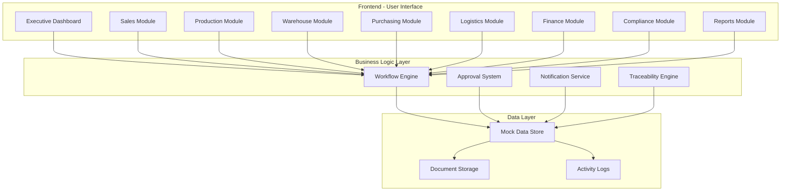
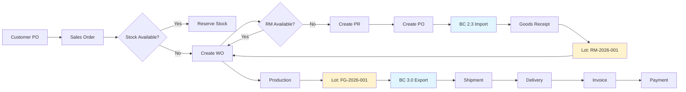

# JKJ Manufacturing ERP - Platform Overview

> **Sistem ERP Terintegrasi untuk Manufaktur dengan Customs Compliance**  
> Version 1.0 | Last Updated: February 2026

---

## 📋 Daftar Isi

1. [Tentang Platform](#tentang-platform)
2. [Arsitektur Sistem](#arsitektur-sistem)
3. [Modul-Modul Utama](#modul-modul-utama)
4. [Alur Kerja End-to-End](#alur-kerja-end-to-end)
5. [Peran & Akses User](#peran--akses-user)
6. [Panduan Cepat](#panduan-cepat)
7. [Fitur Unggulan](#fitur-unggulan)

---

## 🎯 Tentang Platform

### Apa itu JKJ Manufacturing ERP?

JKJ Manufacturing ERP adalah sistem manajemen terintegrasi yang dirancang khusus untuk perusahaan manufaktur yang melakukan **import raw material** dan **export finished goods**. Platform ini menyediakan:

- ✅ **Manajemen Sales Order** - Dari customer PO hingga delivery
- ✅ **Production Planning** - Work order dan BOM management
- ✅ **Warehouse Management** - Inbound, outbound, dan stock tracking
- ✅ **Purchasing** - PO management dan supplier tracking
- ✅ **Customs Compliance** - BC 2.3 (Import) dan BC 3.0 (Export)
- ✅ **Material Traceability** - Pelacakan material dari import hingga export
- ✅ **Finance** - Invoice, payment, dan tax management
- ✅ **Logistics** - Shipment tracking dan delivery management
- ✅ **Reporting** - Analytics dan compliance reports

### Keunggulan Platform

🔹 **Terintegrasi Penuh** - Semua modul terhubung secara real-time  
🔹 **Customs Compliance** - Built-in BC 2.3 dan BC 3.0 management  
🔹 **Material Traceability** - Tracking lot-to-lot dari import ke export  
🔹 **User-Friendly** - Interface modern dan mudah digunakan  
🔹 **Real-time Dashboard** - Monitoring bisnis secara live  
🔹 **Audit Trail** - Semua aktivitas tercatat untuk compliance

---

## 🏗️ Arsitektur Sistem

### Diagram Arsitektur



### Technology Stack

- **Frontend**: Next.js 14 (React), TypeScript
- **UI Components**: Shadcn UI, Tailwind CSS
- **Icons**: Lucide React
- **State Management**: React Hooks
- **Data**: Mock Data (ready for API integration)

---

## 📦 Modul-Modul Utama

### 1. 📊 Executive Dashboard (`/`)

**Fungsi**: Monitoring bisnis secara keseluruhan

**Fitur**:

- Total Revenue (YTD)
- Production Yield metrics
- Inventory Value tracking
- Net Cashflow forecast
- **Customs Compliance status** 🆕
- Workflow status (Sales, Logistics, Finance)
- Recent system activities

**User**: Management, Director

---

### 2. 🛡️ Compliance Dashboard (`/compliance`)

**Fungsi**: Centralized customs compliance monitoring

**Fitur**:

- BC 2.3 Import status (Active, Pending, Approved)
- BC 3.0 Export status (Active, Pending, Approved)
- Material Traceability overview
- Compliance alerts & notifications
- Recent BC activities
- Quick links to all compliance documents

**User**: Compliance Officer, Finance Manager

---

### 3. 🛒 Sales Orders (`/sales`)

**Fungsi**: Manajemen pesanan dari customer

**Fitur**:

- Create & manage sales orders
- Customer PO upload
- Credit limit check
- Stock availability check
- Approval workflow
- Status tracking: Draft → Pending → Approved → In Production → Ready to Ship → Completed

**User**: Sales Admin, Sales Manager

**Auto-trigger**:

- Check FG stock → Reserve atau create WO
- Check RM stock → Create PR jika below reorder point
- Notify Production, Purchasing, Warehouse

---

### 4. 🏭 Production (`/production`)

**Fungsi**: Production planning dan work order management

**Fitur**:

- Production dashboard & planning
- Work Order (WO) creation & tracking
- Bill of Materials (BOM) management
- Production scheduling
- **Lot number assignment** untuk FG
- Conversion tracking (RM → FG)

**User**: Production Planner, Production Manager

**Key Reports**:

- Production efficiency
- **Konversi Bahan Baku** (RM to FG conversion)
- Variance analysis (actual vs standard)
- Waste tracking

---

### 5. 📦 Warehouse (`/warehouse`)

**Fungsi**: Inventory management dan stock control

**Fitur**:

- **Inbound/Receiving**: Goods receipt dari supplier
- **Outbound/Shipping**: Pengiriman ke customer
- Stock level monitoring
- Location tracking
- **Lot/batch tracking**
- Stock movement history

**User**: Warehouse Staff, Warehouse Manager

**Integration**:

- Link to BC 2.3 (import receipt)
- Link to WO (production consumption)
- Link to BC 3.0 (export shipment)

---

### 6. 🛍️ Purchasing (`/purchasing`)

**Fungsi**: Purchase order dan supplier management

**Fitur**:

- Supplier management (add, edit, view)
- Purchase Order (PO) creation & tracking
- **BC 2.3 Import Declaration** 🆕
- Approval workflow
- Vendor performance tracking

**User**: Purchasing Staff, Purchasing Manager

#### 📋 BC 2.3 Import Module (`/purchasing/bc23`)

**Fungsi**: Manajemen dokumen import customs

**Fitur**:

- BC 2.3 document creation & tracking
- HS Code management
- Duty calculations (Bea Masuk, PPN, PPh 22)
- SPPB tracking
- Document checklist (Invoice, Packing List, B/L, COO)
- **Lot number assignment** untuk RM
- Status timeline
- Activity log

**Status Flow**:
`DRAFT` → `SUBMITTED` → `UNDER REVIEW` → `APPROVED` → `CLOSED`

---

### 7. 🚚 Logistics (`/logistics`)

**Fungsi**: Shipment dan delivery management

**Fitur**:

- Shipment tracking
- **BC 3.0 Export Declaration** 🆕
- Delivery scheduling
- POD (Proof of Delivery) management

**User**: Logistics Staff, Logistics Manager

#### 📋 BC 3.0 Export Module (`/logistics/bc30`)

**Fungsi**: Manajemen dokumen export customs

**Fitur**:

- BC 3.0 document creation & tracking
- PEB (Pemberitahuan Ekspor Barang) tracking
- NPE (Nomor Pendaftaran Eksportir)
- **Full traceability chain** (link to BC 2.3)
- Document checklist (Invoice, Packing List, COO, Health Cert, Form E)
- Conversion analysis display
- Status timeline
- Activity log

**Status Flow**:
`DRAFT` → `VERIFIED` → `SUBMITTED` → `UNDER REVIEW` → `APPROVED` → `EXPORTED` → `CLOSED`

---

### 8. 💰 Finance (`/finance`)

**Fungsi**: Financial management dan accounting

**Fitur**:

- Invoice management (AP & AR)
- Payment tracking
- Tax management (Faktur Pajak)
- 3-way matching (PO-GR-Invoice)
- Cash flow monitoring

**User**: Finance Staff, Finance Manager

---

### 9. 📊 Reports (`/reports`)

**Fungsi**: Analytics dan compliance reporting

**Fitur**:

#### 📈 Material Traceability (`/reports/traceability`)

- Visual traceability chain: BC 2.3 → GR → WO → FG → BC 3.0
- Search by: Lot Number, BC 2.3, BC 3.0, WO, PO
- Conversion analysis
- Material Traceability Certificate
- Variance tracking

#### 📦 Stock Movement (`/reports/stock-movement`)

- Period & material filters
- Balance summary (Opening, In, Out, Closing)
- Transaction breakdown:
  - Import (BC 2.3 references)
  - Production (WO references)
  - Export (BC 3.0 references)
  - Waste/Scrap
- Detailed transaction table with lot tracking
- Export to Excel

#### 🏭 Production Yield (`/reports/production`)

- Conversion ratio analysis (actual vs standard)
- Variance tracking per work order
- Waste/scrap monitoring
- BC 2.3 to BC 3.0 linkage
- Material breakdown (Input/Output)

**User**: Management, Compliance Officer, Auditor

---

## 🔄 Alur Kerja End-to-End

### Complete Material Flow



### Traceability Chain

```
BC 2.3 (Import)
    ↓ Lot: RM-2026-001
Goods Receipt (GR)
    ↓
Work Order (WO)
    ↓ Conversion: 90%
Finished Goods (FG)
    ↓ Lot: FG-2026-001
BC 3.0 (Export)
```

### Status Progression

**Sales Order**:
`DRAFT` → `PENDING APPROVAL` → `APPROVED` → `IN PRODUCTION` → `READY TO SHIP` → `COMPLETED`

**Purchase Order**:
`DRAFT` → `PENDING APPROVAL` → `APPROVED` → `SENT TO VENDOR` → `PARTIALLY RECEIVED` → `COMPLETED`

**BC 2.3 Import**:
`DRAFT` → `SUBMITTED` → `UNDER REVIEW` → `APPROVED` → `CLOSED`

**Work Order**:
`DRAFT` → `SCHEDULED` → `IN PROGRESS` → `COMPLETED` → `CLOSED`

**BC 3.0 Export**:
`DRAFT` → `VERIFIED` → `SUBMITTED` → `UNDER REVIEW` → `APPROVED` → `EXPORTED` → `CLOSED`

---

## 👥 Peran & Akses User

### Management Level

**Director / CEO**

- ✅ Executive Dashboard (full access)
- ✅ All reports (view only)
- ✅ Compliance Dashboard
- ✅ Approval authority (high-value transactions)

**Finance Manager**

- ✅ Finance module (full access)
- ✅ BC 2.3 & BC 3.0 verification
- ✅ Invoice & payment management
- ✅ Tax reports

**Compliance Officer**

- ✅ Compliance Dashboard (full access)
- ✅ BC 2.3 & BC 3.0 management
- ✅ Material Traceability reports
- ✅ Audit trail access

### Operational Level

**Sales Manager**

- ✅ Sales Orders (approve/reject)
- ✅ Customer management
- ✅ Sales reports

**Sales Admin**

- ✅ Sales Orders (create/edit)
- ✅ Customer PO upload
- ✅ Stock check

**Production Manager**

- ✅ Production Planning (approve/reject)
- ✅ WO management
- ✅ BOM management
- ✅ Production reports

**Production Planner**

- ✅ Production Planning (create/edit)
- ✅ WO creation
- ✅ Material requirement planning

**Purchasing Manager**

- ✅ Purchase Orders (approve/reject)
- ✅ Supplier management
- ✅ BC 2.3 approval

**Purchasing Staff**

- ✅ Purchase Orders (create/edit)
- ✅ Supplier management
- ✅ BC 2.3 creation

**Warehouse Manager**

- ✅ Warehouse operations (full access)
- ✅ Stock adjustments
- ✅ Inventory reports

**Warehouse Staff**

- ✅ Goods Receipt
- ✅ Goods Issue
- ✅ Stock movement

**Logistics Manager**

- ✅ Shipment management
- ✅ BC 3.0 approval
- ✅ Delivery tracking

**Logistics Staff**

- ✅ Shipment creation
- ✅ BC 3.0 creation
- ✅ Delivery updates

---

## 🚀 Panduan Cepat

### Untuk Sales Admin

**Membuat Sales Order Baru**:

1. Klik menu **Sales Orders** di sidebar
2. Klik tombol **"New Sales Order"**
3. Isi data customer dan produk
4. Upload customer PO
5. Sistem akan auto-check stock availability
6. Submit untuk approval
7. Sales Manager akan menerima notifikasi

### Untuk Purchasing Staff

**Membuat Purchase Order dengan BC 2.3**:

1. Klik menu **Purchasing** → **Purchase Orders**
2. Klik **"New PO"**
3. Pilih supplier dan material
4. Isi quantity dan delivery date
5. Submit untuk approval
6. Setelah PO approved, buat **BC 2.3**:
   - Klik menu **BC 2.3 (Import)**
   - Klik **"New BC 2.3"**
   - Link ke PO yang sudah dibuat
   - Isi HS Code, CIF Value
   - Sistem auto-calculate duties
   - Submit ke customs

### Untuk Production Planner

**Membuat Work Order**:

1. Klik menu **Production** → **Work Orders**
2. Klik **"New Work Order"**
3. Pilih product dan quantity
4. Link ke Sales Order (jika ada)
5. Sistem akan auto-populate BOM
6. Check material availability
7. Schedule production
8. Submit untuk approval

### Untuk Warehouse Staff

**Goods Receipt (dari Import)**:

1. Klik menu **Warehouse** → **Inbound**
2. Klik **"New Goods Receipt"**
3. Link ke PO dan BC 2.3
4. Scan/input lot number (e.g., RM-2026-001)
5. Verify quantity vs PO
6. Complete GR
7. Stock akan auto-update

### Untuk Logistics Staff

**Membuat BC 3.0 Export**:

1. Klik menu **Logistics** → **BC 3.0 (Export)**
2. Klik **"New BC 3.0"**
3. Link ke Sales Order
4. Pilih finished goods (dengan lot number)
5. Sistem akan auto-show traceability chain
6. Isi PEB details
7. Submit untuk verification
8. Setelah approved, proceed dengan shipment

### Untuk Compliance Officer

**Monitoring Compliance**:

1. Klik menu **Compliance** di sidebar
2. Dashboard akan show:
   - BC 2.3 pending review
   - BC 3.0 pending review
   - Traceability gaps
   - Recent activities
3. Klik alert untuk detail
4. Review dan approve/reject
5. Generate reports untuk audit

---

## ⭐ Fitur Unggulan

### 1. 🔗 Material Traceability

**Full Chain Tracking**:

- Setiap material import mendapat **lot number** unik
- Tracking dari BC 2.3 → GR → WO → FG → BC 3.0
- Visual traceability chain di setiap detail page
- Material Traceability Certificate untuk audit

**Keuntungan**:

- ✅ Compliance dengan Bea Cukai
- ✅ Quality control & recall management
- ✅ Audit trail lengkap
- ✅ Transparency untuk customer

### 2. 📊 Conversion Analysis

**Automatic Calculation**:

- Conversion ratio: FG produced / RM consumed
- Variance: Actual vs Standard ratio
- Waste tracking
- Efficiency metrics

**Reports**:

- Konversi Bahan Baku Report
- Production Yield Analysis
- Variance by Work Order
- Waste Analysis

### 3. 🛡️ Customs Compliance

**BC 2.3 Import**:

- HS Code management
- Duty auto-calculation
- SPPB tracking
- Document checklist
- Status timeline

**BC 3.0 Export**:

- PEB tracking
- NPE management
- Link to source BC 2.3
- Export certificate
- Compliance alerts

**Compliance Dashboard**:

- Real-time monitoring
- Automated alerts
- Traceability overview
- Audit-ready reports

### 4. 📈 Real-time Dashboard

**Executive Dashboard**:

- Revenue tracking
- Production metrics
- Inventory value
- Cashflow forecast
- **Customs compliance status**
- Workflow monitoring

**Module Dashboards**:

- Sales performance
- Production efficiency
- Warehouse utilization
- Purchasing analytics
- Logistics tracking

### 5. 🔔 Smart Notifications

**Auto-triggers**:

- Stock below reorder point → Create PR
- SO approved → Notify Production & Warehouse
- BC pending > 3 days → Alert Compliance
- Payment overdue → Alert Finance
- WO delayed → Alert Production Manager

### 6. 📝 Comprehensive Reporting

**Daily Reports**:

- Production summary
- Stock movement (with BC references)
- BC status dashboard
- Cash flow

**Monthly Reports**:

- BC 2.3 & BC 3.0 summary
- Material Traceability Report
- Production Conversion Report
- Financial statements

**Audit Reports**:

- BC 2.3 to BC 3.0 Reconciliation
- Material Traceability Certificate
- Stock Movement by Material
- Conversion Analysis

---

## 🎯 Best Practices

### Data Entry

✅ **DO**:

- Selalu isi lot number saat GR
- Upload dokumen pendukung (PO, Invoice, etc)
- Verify data sebelum submit
- Gunakan HS Code yang benar

❌ **DON'T**:

- Skip approval workflow
- Edit data setelah approved (gunakan adjustment)
- Hapus historical data
- Manual override tanpa dokumentasi

### Workflow Management

✅ **DO**:

- Follow status progression
- Document rejection reasons
- Keep activity log updated
- Notify stakeholders

❌ **DON'T**:

- Skip approval steps
- Bypass customs compliance
- Ignore alerts & notifications
- Delay document submission

### Compliance

✅ **DO**:

- Submit BC documents on time
- Maintain complete traceability
- Generate reports regularly
- Keep audit trail

❌ **DON'T**:

- Skip BC 2.3 for imports
- Skip BC 3.0 for exports
- Break traceability chain
- Ignore compliance alerts

---

## 📞 Support & Training

### Getting Help

**In-App Help**:

- Hover tooltips pada setiap field
- Status badge explanations
- Workflow guides

**Documentation**:

- Detailed Workflow Specification
- Implementation Plan
- Walkthrough Guides

**Training Materials**:

- User role-based training
- Module-specific guides
- Video tutorials (coming soon)

### Common Issues

**Q: Stock tidak update setelah GR?**  
A: Pastikan GR sudah di-complete, bukan masih draft.

**Q: BC 2.3 tidak bisa submit?**  
A: Check apakah semua required fields sudah diisi (HS Code, CIF Value, Documents).

**Q: Traceability chain tidak muncul?**  
A: Pastikan lot number sudah di-assign di BC 2.3 dan WO.

**Q: Conversion ratio salah?**  
A: Verify BOM standard ratio dan actual quantity di WO.

---

## 🔮 Roadmap

### Phase 1 ✅ (Completed)

- Core modules (Sales, Production, Warehouse, Purchasing)
- BC 2.3 & BC 3.0 management
- Material Traceability System
- Compliance Dashboard
- Executive Dashboard

### Phase 2 🚧 (In Progress)

- Finance module completion
- Logistics module enhancement
- Advanced reporting
- User management & permissions

### Phase 3 📋 (Planned)

- CEISA integration (real customs API)
- Mobile app
- Advanced analytics & AI
- Multi-warehouse support
- Multi-currency support

---

## 📄 Appendix

### Glossary

- **BC 2.3**: Dokumen Pemberitahuan Impor Barang (Import Declaration)
- **BC 3.0**: Dokumen Pemberitahuan Ekspor Barang (Export Declaration)
- **PEB**: Pemberitahuan Ekspor Barang
- **SPPB**: Surat Persetujuan Pengeluaran Barang
- **NPE**: Nomor Pendaftaran Eksportir
- **HS Code**: Harmonized System Code (kode tarif barang)
- **CIF**: Cost, Insurance, and Freight
- **FOB**: Free on Board
- **GR**: Goods Receipt
- **WO**: Work Order
- **BOM**: Bill of Materials
- **FG**: Finished Goods
- **RM**: Raw Material

### Document Checklist

**BC 2.3 Import**:

- ✅ Commercial Invoice
- ✅ Packing List
- ✅ Bill of Lading (B/L)
- ✅ Certificate of Origin (COO)

**BC 3.0 Export**:

- ✅ Commercial Invoice
- ✅ Packing List
- ✅ Certificate of Origin (Form E, etc)
- ✅ Health Certificate (if required)
- ✅ Other certificates (as needed)

---

**© 2026 JKJ Manufacturing ERP**  
_Built for Manufacturing Excellence with Customs Compliance_
