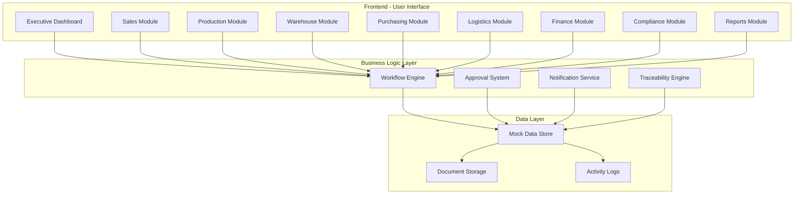
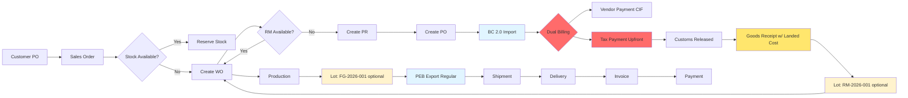

# JKJ Manufacturing ERP - Platform Overview

> **Sistem ERP Terintegrasi untuk Manufaktur dengan BC 2.0 Regular Import System**
> Version 2.0 | Last Updated: March 2026
>
> **Key Features**: Dual Billing • Upfront Tax Payment • Landed Cost • Tax Asset Management

---

## 📋 Daftar Isi

1. [Tentang Platform](#tentang-platform)
2. [Arsitektur Sistem](#arsitektur-sistem)
3. [Modul-Modul Utama](#modul-modul-utama)
4. [Alur Kerja End-to-End](#alur-kerja-end-to-end)
5. [Peran & Akses User](#peran--akses-user)
6. [Panduan Cepat](#panduan-cepat)
7. [Fitur Unggulan](#fitur-unggulan)

---

## 🎯 Tentang Platform

### Apa itu JKJ Manufacturing ERP?

JKJ Manufacturing ERP adalah sistem manajemen terintegrasi yang dirancang khusus untuk perusahaan manufaktur yang melakukan **import raw material** dan **export finished goods**. Platform ini menyediakan:

- ✅ **Manajemen Sales Order** - Dari customer PO hingga delivery
- ✅ **Production Planning** - Work order dan BOM management
- ✅ **Warehouse Management** - Inbound, outbound, dan stock tracking
- ✅ **Purchasing** - PO management dan supplier tracking
- ✅ **Customs Compliance** - BC 2.0 (PIB - Regular Import) and PEB (Regular Export)
- ✅ **Material Traceability** - Pelacakan material dari import hingga export (optional)
- ✅ **Finance** - Invoice, payment, tax asset management, dan landed cost
- ✅ **Logistics** - Shipment tracking dan delivery management
- ✅ **Reporting** - Analytics dan compliance reports

### Keunggulan Platform

🔹 **Terintegrasi Penuh** - Semua modul terhubung secara real-time
🔹 **BC 2.0 System** - Dual billing (vendor + tax), landed cost, tax asset tracking
🔹 **Material Traceability** - Optional internal tracking untuk quality control
🔹 **User-Friendly** - Interface modern dan mudah digunakan
🔹 **Real-time Dashboard** - Monitoring bisnis secara live
🔹 **Audit Trail** - Semua aktivitas tercatat untuk compliance

---

## 🏗️ Arsitektur Sistem

### Diagram Arsitektur


```mermaid
graph TB
    subgraph "Frontend - User Interface"
        A[Executive Dashboard]
        B[Sales Module]
        C[Production Module]
        D[Warehouse Module]
        E[Purchasing Module]
        F[Logistics Module]
        G[Finance Module]
        H[Compliance Module]
        I[Reports Module]
    end

    subgraph "Business Logic Layer"
        J[Workflow Engine]
        K[Approval System]
        L[Notification Service]
        M[Traceability Engine]
    end

    subgraph "Data Layer"
        N[Mock Data Store]
        O[Document Storage]
        P[Activity Logs]
    end

    A --> J
    B --> J
    C --> J
    D --> J
    E --> J
    F --> J
    G --> J
    H --> J
    I --> J

    J --> N
    K --> N
    L --> N
    M --> N

    N --> O
    N --> P
```

### Technology Stack

- **Frontend**: Next.js 14 (React), TypeScript
- **UI Components**: Shadcn UI, Tailwind CSS
- **Icons**: Lucide React
- **State Management**: React Hooks
- **Data**: Mock Data (ready for API integration)

---

## 📦 Modul-Modul Utama

### 1. 📊 Executive Dashboard (`/`)

**Fungsi**: Monitoring bisnis secara keseluruhan

**Fitur**:

- Total Revenue (YTD)
- Production Yield metrics
- Inventory Value tracking (with landed cost)
- Net Cashflow forecast
- **Customs Compliance status** 🆕
  - BC 2.0 tax payment pending alerts
  - Dual billing status
  - Tax asset balance (PPN & PPh prepaid)
- Workflow status (Sales, Logistics, Finance)
- Recent system activities

**User**: Management, Director

---

### 2. 🛡️ Compliance Dashboard (`/compliance`)

**Fungsi**: Centralized customs compliance and tax asset monitoring

**Fitur**:

- BC 2.0 Import status (Active, Pending, Tax Payment Pending, Approved)
- PEB Export status (Active, Pending, Approved)
- **Dual Billing Tracking** (Vendor payment vs Tax payment)
- **Tax Asset Dashboard** (PPN & PPh 22 prepaid balance)
- Material Traceability overview (optional)
- Compliance alerts & notifications
- Recent BC activities
- Quick links to all compliance documents

**User**: Compliance Officer, Finance Manager

---

### 3. 🛒 Sales Orders (`/sales`)

**Fungsi**: Manajemen pesanan dari customer

**Fitur**:

- Create & manage sales orders
- Customer PO upload
- Credit limit check
- Stock availability check
- Approval workflow
- Status tracking: Draft → Pending → Approved → In Production → Ready to Ship → Completed

**User**: Sales Admin, Sales Manager

**Auto-trigger**:

- Check FG stock → Reserve atau create WO
- Check RM stock → Create PR jika below reorder point
- Notify Production, Purchasing, Warehouse

---

### 4. 🏭 Production (`/production`)

**Fungsi**: Production planning dan work order management

**Fitur**:

- Production dashboard & planning
- Work Order (WO) creation & tracking
- Bill of Materials (BOM) management
- Production scheduling
- **Lot number assignment** untuk FG
- Conversion tracking (RM → FG)

**User**: Production Planner, Production Manager

**Key Reports**:

- Production efficiency
- **Konversi Bahan Baku** (RM to FG conversion)
- Variance analysis (actual vs standard)
- Waste tracking

---

### 5. 📦 Warehouse (`/warehouse`)

**Fungsi**: Inventory management dan stock control

**Fitur**:

- **Inbound/Receiving**: Goods receipt dari supplier
- **Outbound/Shipping**: Pengiriman ke customer
- Stock level monitoring
- Location tracking
- **Lot/batch tracking**
- Stock movement history

**User**: Warehouse Staff, Warehouse Manager

**Integration**:

- Link to BC 2.0 (import receipt with landed cost)
- **Blocked until BC 2.0 status = "CUSTOMS RELEASED"**
- Link to WO (production consumption)
- Link to PEB (export shipment - optional linkage)
- **Auto-record inventory at landed cost** (CIF + Bea Masuk + freight)
- **Auto-generate journal entries** for tax assets

---

### 6. 🛍️ Purchasing (`/purchasing`)

**Fungsi**: Purchase order dan supplier management

**Fitur**:

- Supplier management (add, edit, view)
- Purchase Order (PO) creation & tracking
- **BC 2.0 Import Declaration** 🆕
- Approval workflow
- Vendor performance tracking

**User**: Purchasing Staff, Purchasing Manager

#### 📋 BC 2.0 Import Module (`/purchasing/bc20`)

**Fungsi**: Manajemen dokumen import customs dengan dual billing system

**Fitur**:

- BC 2.0 (PIB) document creation & tracking
- HS Code management
- **Dual Billing System**:
  - Vendor billing (CIF payment)
  - Tax billing (Bea Masuk, PPN, PPh 22)
- **Automatic Duty Calculation**:
  - CIF = FOB + Freight + Insurance
  - Bea Masuk = CIF × HS Code rate
  - PPN Import = (CIF + Bea Masuk) × 11%
  - PPh 22 = CIF × PPh rate (2.5%/7.5%/10%)
- **Landed Cost Calculation** (CIF + Bea Masuk + freight)
- **Tax Payment Blocking** - Goods cannot be released until taxes paid
- **Tax Asset Recording**:
  - PPN as prepaid tax (input credit)
  - PPh 22 as prepaid income tax
- Document checklist (Invoice, Packing List, B/L, COO)
- SPPB tracking
- **Lot number assignment** untuk RM
- Status timeline
- Activity log

**Status Flow**:
`DRAFT` → `SUBMITTED` → `UNDER CUSTOMS REVIEW` → `TAX PAYMENT PENDING` → `TAX PAID` → `CUSTOMS RELEASED` → `GOODS RECEIVED` → `CLOSED`

---

### 7. 🚚 Logistics (`/logistics`)

**Fungsi**: Shipment dan delivery management

**Fitur**:

- Shipment tracking
- **PEB Export Declaration** 🆕
- Delivery scheduling
- POD (Proof of Delivery) management

**User**: Logistics Staff, Logistics Manager

#### 📋 PEB Export Module (`/logistics/peb`)

**Fungsi**: Manajemen dokumen export customs (regular export)

**Fitur**:

- PEB (Pemberitahuan Ekspor Barang) creation & tracking
- NPE (Nomor Pendaftaran Eksportir)
- **Simple Regular Export** - No mandatory BC 2.0 linkage
- **Optional Traceability** - Link to BC 2.0 for internal tracking only
- Document checklist (Invoice, Packing List, COO, Health Cert, Form E)
- Zero-rated VAT for exports
- Status timeline
- Activity log

**Key Differences from BC 2.3 System**:
- ✅ No mandatory material traceability to BC 2.0
- ✅ No conversion analysis required
- ✅ Simplified export process
- ✅ Can sell domestically or export freely

**Status Flow**:
`DRAFT` → `VERIFIED` → `SUBMITTED` → `UNDER REVIEW` → `APPROVED` → `EXPORTED` → `CLOSED`

---

### 8. 💰 Finance (`/finance`)

**Fungsi**: Financial management, accounting, dan tax asset tracking

**Fitur**:

#### Accounts Receivable (`/finance/ar`)

- AR Invoice list dengan filters
- Auto-generate invoice dari SO
- Faktur Pajak generation (11% PPN for domestic, 0% for export)
- Payment recording
- Aging report (30/60/90 days)
- Collection reminders

#### Accounts Payable (`/finance/ap`)

- Vendor invoice list
- **Dual Billing Management**:
  - Vendor payment (CIF value in foreign currency)
  - Tax payment (duties in IDR to Customs)
- 3-way matching (PO - GR - Invoice)
- Tax verification
- Payment scheduling
- Approval workflow
- Link to BC 2.0 for duty payments

#### Payment Management (`/finance/payments`)

- Payment list (AR & AP)
- Dual payment tracking:
  - Vendor payments (overseas)
  - Tax payments (Customs/DJBC)
- Payment recording
- Bank reconciliation
- Payment method tracking (Bank Transfer, Cash, Check, Credit Card)
- Receipt generation
- Payment history

#### Tax Asset Management (`/finance/tax-assets`) 🆕

**Fungsi**: Track prepaid tax assets dari import

**Fitur**:

- **PPN Import Tracking**:
  - Record PPN Import as prepaid tax (input credit)
  - Available balance for offset against PPN Keluaran
  - Monthly PPN reconciliation report
  - Credit carry-forward tracking

- **PPh 22 Import Tracking**:
  - Record PPh 22 as prepaid income tax
  - Available balance for annual tax credit
  - Year-to-date tracking
  - Tax credit utilization report

- **Tax Asset Dashboard**:
  - Total PPN prepaid balance
  - Total PPh 22 prepaid balance
  - Monthly usage and remaining credit
  - Linked to BC 2.0 documents

- **Landed Cost Journal Entries**:
  - Auto-generate journal entries on goods receipt
  - DR: Raw Material Inventory (Landed Cost)
  - DR: PPN Prepaid (Tax Asset)
  - DR: PPh 22 Prepaid (Tax Asset)
  - CR: Accounts Payable - Vendor (CIF)
  - CR: Accounts Payable - Customs (Duties)

**User**: Finance Staff, Finance Manager, Tax Accountant

**Integration**:

- Auto-generate AR invoice from SO
- Link AP invoice to PO + GR
- **Dual billing from BC 2.0**: Vendor payment + Tax payment
- **Auto-calculate landed cost** and capitalize to inventory
- **Record PPN & PPh as tax assets**, not expenses
- Update SO/PO status when paid
- Monthly tax reporting integration

---

### 9. 🚚 Logistics (`/logistics`)

**Fungsi**: Shipment, fleet, dan delivery management

**Fitur**:

#### Logistics Dashboard

- Active shipments count
- Fleet utilization chart (PieChart)
- Shipment trend chart (LineChart)
- Delivery performance metrics
- BC 3.0 status overview

#### Fleet Management (`/logistics/fleet`)

- Vehicle list (trucks, vans, etc)
- Driver list
- Availability status
- Maintenance tracking
- Utilization monitoring

#### Shipment Tracking (`/logistics/shipments`)

- Shipment list with tracking
- Create shipment from SO
- Link to BC 3.0 export
- Driver & vehicle assignment
- Real-time status updates
- POD (Proof of Delivery) management

**User**: Logistics Staff, Logistics Manager

#### 📋 BC 3.0 Export Module (`/logistics/bc30`)

**Fungsi**: Manajemen dokumen export customs

**Fitur**:

- BC 3.0 document creation & tracking
- PEB (Pemberitahuan Ekspor Barang) tracking
- NPE (Nomor Pendaftaran Eksportir)
- **Full traceability chain** (link to BC 2.3)
- Document checklist (Invoice, Packing List, COO, Health Cert, Form E)
- Conversion analysis display
- Status timeline
- Activity log

**Status Flow**:
`DRAFT` → `VERIFIED` → `SUBMITTED` → `UNDER REVIEW` → `APPROVED` → `EXPORTED` → `CLOSED`

---

### 10. 📊 Reports (`/reports`)

**Fungsi**: Analytics, insights, dan compliance reporting

**Fitur**:

#### Reports Overview (`/reports`)

- Revenue Trend chart (LineChart)
- Top Customers visualization
- Executive summary metrics

#### Sales Analysis (`/reports/sales`)

- Revenue & Orders Trend (LineChart)
- Monthly Orders (BarChart)
- Sales by Product Category (PieChart)
- Top Customers by Revenue (BarChart)
- Summary metrics (Total Revenue, Orders, Avg Order Value, Active Customers)

#### Inventory Valuation (`/reports/inventory`)

- Inventory Value by Category (BarChart)
- Stock Status Distribution (PieChart)
- Inventory Value & Turnover Trend (LineChart)
- Top Items by Value (BarChart)
- Summary metrics (Total Value, Turnover, SKUs, Low Stock Items)

#### 📈 Material Traceability (`/reports/traceability`)

**Note**: Material traceability is **optional** for BC 2.0 (regular import). This feature is for **internal quality control** purposes only, not mandatory for customs compliance.

**Fitur**:

- Visual traceability chain: BC 2.0 → GR → WO → FG → PEB (optional)
- Search by: Lot Number, BC 2.0, PEB, WO, PO
- Conversion analysis (internal tracking)
- Material Traceability Certificate (for customer requirements)
- Variance tracking

**Use Cases**:
- Quality control and recall management
- ISO certification requirements
- Customer transparency requirements
- Internal process optimization

#### 📦 Stock Movement (`/reports/stock-movement`)

- Period & material filters
- Balance summary (Opening, In, Out, Closing)
- **Inventory valued at landed cost**
- Transaction breakdown:
  - Import (BC 2.0 references with landed cost)
  - Production (WO references)
  - Export (PEB references - optional linkage)
  - Waste/Scrap
- Detailed transaction table with optional lot tracking
- Export to Excel

#### 🏭 Production Yield (`/reports/production`)

- Conversion ratio analysis (actual vs standard)
- Variance tracking per work order
- Waste/scrap monitoring
- **Optional**: BC 2.0 to PEB linkage (internal tracking only)
- Material breakdown (Input/Output)
- **COGS includes landed cost** (CIF + Bea Masuk + freight)

**User**: Management, Compliance Officer, Auditor

---

## 🔄 Alur Kerja End-to-End

### Complete Material Flow (BC 2.0 System)


```mermaid
graph LR
    A[Customer PO] --> B[Sales Order]
    B --> C{Stock Available?}
    C -->|Yes| D[Reserve Stock]
    C -->|No| E[Create WO]
    E --> F{RM Available?}
    F -->|No| G[Create PR]
    G --> H[Create PO]
    H --> I[BC 2.0 Import]
    I --> J{Dual Billing}
    J --> K1[Vendor Payment CIF]
    J --> K2[Tax Payment Upfront]
    K2 --> L[Customs Released]
    L --> M[Goods Receipt w/ Landed Cost]
    M --> N[Lot: RM-2026-001 optional]
    N --> E
    F -->|Yes| E
    E --> O[Production]
    O --> P[Lot: FG-2026-001 optional]
    P --> Q[PEB Export Regular]
    Q --> R[Shipment]
    R --> S[Delivery]
    S --> T[Invoice]
    T --> U[Payment]

    style I fill:#e1f5ff
    style J fill:#ff6b6b
    style K2 fill:#ff6b6b
    style M fill:#ffe66d
    style Q fill:#e1f5ff
    style N fill:#fff3cd
    style P fill:#fff3cd
```

### Traceability Chain (Optional for BC 2.0)

**Note**: For BC 2.0 (regular import), this traceability is **optional** and for internal purposes only.

```
BC 2.0 (Import) → Dual Billing → Tax Payment (Upfront)
    ↓ Customs Released
Goods Receipt (GR) with Landed Cost
    ↓ Optional Lot: RM-2026-001
    ↓ Tax Assets: PPN & PPh 22 recorded
Work Order (WO)
    ↓ Conversion: 90% (internal tracking)
Finished Goods (FG)
    ↓ Optional Lot: FG-2026-001
PEB (Regular Export) - No mandatory link to BC 2.0
```

**Key Differences from BC 2.3 Bonded System**:
- ✅ Tax paid **upfront** (not deferred)
- ✅ Landed cost capitalized to inventory
- ✅ PPN & PPh as **tax assets** (not deferred)
- ✅ Traceability is **optional** (not mandatory for customs)
- ✅ Can sell domestically or export (no export obligation)

### Status Progression

**Sales Order**:
`DRAFT` → `PENDING APPROVAL` → `APPROVED` → `IN PRODUCTION` → `READY TO SHIP` → `COMPLETED`

**Purchase Order**:
`DRAFT` → `PENDING APPROVAL` → `APPROVED` → `SENT TO VENDOR` → `PARTIALLY RECEIVED` → `COMPLETED`

**BC 2.0 Import** (with Tax Payment Blocking):
`DRAFT` → `SUBMITTED` → `UNDER CUSTOMS REVIEW` → `TAX PAYMENT PENDING` ⚠️ → `TAX PAID` → `CUSTOMS RELEASED` → `GOODS RECEIVED` → `CLOSED`

**Work Order**:
`DRAFT` → `SCHEDULED` → `IN PROGRESS` → `COMPLETED` → `CLOSED`

**PEB Export** (Regular):
`DRAFT` → `VERIFIED` → `SUBMITTED` → `UNDER REVIEW` → `APPROVED` → `EXPORTED` → `CLOSED`

**Key Status Notes**:
- ⚠️ **TAX PAYMENT PENDING**: Goods **cannot** be received until status changes to "CUSTOMS RELEASED"
- Finance must pay Bea Masuk, PPN, PPh 22 to proceed
- Dual billing created at "SUBMITTED" status

---

## 👥 Peran & Akses User

### Management Level

**Director / CEO**

- ✅ Executive Dashboard (full access)
- ✅ All reports (view only)
- ✅ Compliance Dashboard
- ✅ Approval authority (high-value transactions)

**Finance Manager**

- ✅ Finance module (full access)
- ✅ BC 2.3 & BC 3.0 verification
- ✅ Invoice & payment management
- ✅ Tax reports

**Compliance Officer**

- ✅ Compliance Dashboard (full access)
- ✅ BC 2.3 & BC 3.0 management
- ✅ Material Traceability reports
- ✅ Audit trail access

### Operational Level

**Sales Manager**

- ✅ Sales Orders (approve/reject)
- ✅ Customer management
- ✅ Sales reports

**Sales Admin**

- ✅ Sales Orders (create/edit)
- ✅ Customer PO upload
- ✅ Stock check

**Production Manager**

- ✅ Production Planning (approve/reject)
- ✅ WO management
- ✅ BOM management
- ✅ Production reports

**Production Planner**

- ✅ Production Planning (create/edit)
- ✅ WO creation
- ✅ Material requirement planning

**Purchasing Manager**

- ✅ Purchase Orders (approve/reject)
- ✅ Supplier management
- ✅ BC 2.3 approval

**Purchasing Staff**

- ✅ Purchase Orders (create/edit)
- ✅ Supplier management
- ✅ BC 2.3 creation

**Warehouse Manager**

- ✅ Warehouse operations (full access)
- ✅ Stock adjustments
- ✅ Inventory reports

**Warehouse Staff**

- ✅ Goods Receipt
- ✅ Goods Issue
- ✅ Stock movement

**Logistics Manager**

- ✅ Shipment management
- ✅ BC 3.0 approval
- ✅ Delivery tracking

**Logistics Staff**

- ✅ Shipment creation
- ✅ BC 3.0 creation
- ✅ Delivery updates

---

## 🚀 Panduan Cepat

### Untuk Sales Admin

**Membuat Sales Order Baru**:

1. Klik menu **Sales Orders** di sidebar
2. Klik tombol **"New Sales Order"**
3. Isi data customer dan produk
4. Upload customer PO
5. Sistem akan auto-check stock availability
6. Submit untuk approval
7. Sales Manager akan menerima notifikasi

### Untuk Purchasing Staff

**Membuat Purchase Order dengan BC 2.0**:

1. Klik menu **Purchasing** → **Purchase Orders**
2. Klik **"New PO"**
3. Pilih supplier dan material
4. Isi quantity, FOB price, freight, insurance
5. Sistem akan show estimated total cost (CIF + duties)
6. Submit untuk approval
7. Setelah PO approved, buat **BC 2.0**:
   - Klik menu **BC 2.0 (Import)**
   - Klik **"New BC 2.0"**
   - Link ke PO yang sudah dibuat
   - Isi HS Code, FOB, Freight, Insurance
   - Sistem auto-calculate:
     - CIF = FOB + Freight + Insurance
     - Bea Masuk, PPN Import, PPh 22
   - **Dual billing auto-created**:
     - Vendor billing (CIF payment)
     - Tax billing (Bea Masuk + PPN + PPh)
   - Submit ke customs
8. **Finance harus bayar tax** sebelum barang bisa diambil
9. Setelah tax paid, customs akan release (SPPB)

### Untuk Production Planner

**Membuat Work Order**:

1. Klik menu **Production** → **Work Orders**
2. Klik **"New Work Order"**
3. Pilih product dan quantity
4. Link ke Sales Order (jika ada)
5. Sistem akan auto-populate BOM
6. Check material availability
7. Schedule production
8. Submit untuk approval

### Untuk Warehouse Staff

**Goods Receipt (dari Import)**:

1. Pastikan BC 2.0 status = **"CUSTOMS RELEASED"**
   - Jika masih "TAX PAYMENT PENDING", goods **tidak bisa** diterima
   - Tunggu Finance bayar tax terlebih dahulu
2. Klik menu **Warehouse** → **Inbound**
3. Klik **"New Goods Receipt"**
4. Link ke PO dan BC 2.0
5. Sistem akan auto-show **landed cost**:
   - CIF + Bea Masuk + domestic freight + handling
   - **PPN & PPh TIDAK termasuk** (itu tax asset)
6. Scan/input lot number (optional, e.g., RM-2026-001)
7. Verify quantity vs PO
8. Complete GR
9. Stock akan auto-update dengan **landed cost** sebagai unit cost
10. Journal entry auto-generated:
    - DR: Raw Material Inventory (Landed Cost)
    - DR: PPN Prepaid (Tax Asset)
    - DR: PPh 22 Prepaid (Tax Asset)
    - CR: AP Vendor, CR: AP Customs

### Untuk Logistics Staff

**Membuat PEB Export (Regular)**:

1. Klik menu **Logistics** → **PEB (Export)**
2. Klik **"New PEB"**
3. Link ke Sales Order
4. Pilih finished goods
5. **No mandatory BC 2.0 linkage** - Simple export process
6. Optional: Link to lot number for internal traceability
7. Isi PEB details
8. Zero-rated VAT (no PPN charged)
9. Submit untuk verification
10. Setelah approved, proceed dengan shipment

**Note**:
- Tidak perlu link ke BC 2.0 import (tidak seperti BC 2.3 system)
- Tidak perlu conversion analysis untuk customs
- Export process lebih simple
- Traceability optional, hanya untuk keperluan internal/customer

### Untuk Compliance Officer

**Monitoring Compliance**:

1. Klik menu **Compliance** di sidebar
2. Dashboard akan show:
   - BC 2.0 pending review
   - BC 2.0 tax payment pending (blocking status)
   - PEB pending review
   - **Dual billing status** (vendor vs tax payment)
   - **Tax asset balance** (PPN & PPh prepaid)
   - Optional traceability overview
   - Recent activities
3. Klik alert untuk detail
4. Review dan approve/reject
5. **Monitor tax payment** - Critical for goods release
6. Generate reports untuk audit

**Key Monitoring Points**:
- ⚠️ Tax payment delays (blocks goods release)
- ⚠️ Dual billing reconciliation
- ℹ️ Tax asset utilization (PPN & PPh credit)
- ℹ️ Landed cost accuracy

---

## ⭐ Fitur Unggulan

### 1. 🔗 Material Traceability (Optional)

**Note**: Untuk BC 2.0 (regular import), material traceability adalah **optional** dan untuk **keperluan internal** saja, bukan mandatory untuk customs compliance.

**Full Chain Tracking** (Optional):

- Setiap material import dapat diberi **lot number** unik
- Tracking dari BC 2.0 → GR → WO → FG → PEB (if implemented)
- Visual traceability chain di setiap detail page
- Material Traceability Certificate untuk customer requirements

**Keuntungan**:

- ✅ Quality control & recall management (internal)
- ✅ Audit trail lengkap untuk ISO certification
- ✅ Transparency untuk customer (if required)
- ✅ Process optimization
- ⚠️ **NOT mandatory** for customs compliance (unlike BC 2.3 bonded system)

### 2. 📊 Conversion Analysis

**Automatic Calculation**:

- Conversion ratio: FG produced / RM consumed
- Variance: Actual vs Standard ratio
- Waste tracking
- Efficiency metrics

**Reports**:

- Konversi Bahan Baku Report
- Production Yield Analysis
- Variance by Work Order
- Waste Analysis

### 3. 🛡️ Customs Compliance

**BC 2.0 Import (Regular)**:

- HS Code management
- **Dual Billing System**:
  - Vendor payment (CIF)
  - Tax payment (Bea Masuk, PPN, PPh 22)
- **Auto-calculation**:
  - CIF = FOB + Freight + Insurance
  - Bea Masuk, PPN Import, PPh 22
- **Upfront Tax Payment** - Must pay before goods release
- **Landed Cost Capitalization** - CIF + Bea Masuk + freight to inventory
- **Tax Asset Recording** - PPN & PPh 22 as prepaid tax
- SPPB tracking
- Document checklist
- Status timeline

**PEB Export (Regular)**:

- PEB tracking
- NPE management
- **No mandatory BC 2.0 linkage** - Simple export process
- **Optional traceability** for internal purposes only
- Zero-rated VAT
- Export certificate
- Compliance alerts

**Compliance Dashboard**:

- Real-time monitoring
- Dual billing status tracking
- Tax asset balance overview
- Automated alerts
- Optional traceability overview
- Audit-ready reports

### 4. 📈 Real-time Dashboard

**Executive Dashboard**:

- Revenue tracking
- Production metrics
- Inventory value
- Cashflow forecast
- **Customs compliance status**
- Workflow monitoring

**Module Dashboards**:

- Sales performance
- Production efficiency
- Warehouse utilization
- Purchasing analytics
- Logistics tracking

### 5. 🔔 Smart Notifications

**Auto-triggers**:

- Stock below reorder point → Create PR
- SO approved → Notify Production & Warehouse
- BC pending > 3 days → Alert Compliance
- Payment overdue → Alert Finance
- WO delayed → Alert Production Manager

### 6. 📝 Comprehensive Reporting

**Daily Reports**:

- Production summary (with landed cost COGS)
- Stock movement (with BC 2.0 references and landed cost)
- **Dual billing status** (vendor payment vs tax payment)
- **Tax payment pending alerts**
- Cash flow (including upfront tax payments)

**Monthly Reports**:

- BC 2.0 & PEB summary
- **Tax Asset Report** (PPN & PPh prepaid balance)
- **Landed Cost Analysis** (by material and period)
- **Monthly PPN Reconciliation** (Masukan vs Keluaran)
- Optional: Material Traceability Report (internal)
- Production Conversion Report
- Financial statements (with tax assets)

**Audit Reports**:

- **Dual Billing Reconciliation** (vendor vs tax)
- **Tax Asset Utilization** (PPN & PPh credit tracking)
- **Landed Cost Breakdown** (CIF + Bea Masuk + freight)
- Optional: Material Traceability Certificate (for customers)
- Stock Movement by Material (valued at landed cost)
- Optional: Conversion Analysis (internal tracking)

---

## 🎯 Best Practices

### Data Entry

✅ **DO**:

- Selalu isi lot number saat GR
- Upload dokumen pendukung (PO, Invoice, etc)
- Verify data sebelum submit
- Gunakan HS Code yang benar

❌ **DON'T**:

- Skip approval workflow
- Edit data setelah approved (gunakan adjustment)
- Hapus historical data
- Manual override tanpa dokumentasi

### Workflow Management

✅ **DO**:

- Follow status progression
- Document rejection reasons
- Keep activity log updated
- Notify stakeholders

❌ **DON'T**:

- Skip approval steps
- Bypass customs compliance
- Ignore alerts & notifications
- Delay document submission

### Compliance

✅ **DO**:

- Submit BC 2.0 documents on time
- **Pay taxes upfront** before customs release
- Track dual billing (vendor + tax) separately
- Record PPN & PPh 22 as tax assets
- Calculate and capitalize landed cost to inventory
- Generate reports regularly
- Keep audit trail

❌ **DON'T**:

- Skip BC 2.0 for imports
- Skip tax payment (blocks goods release)
- Capitalize PPN/PPh to inventory cost (should be tax assets)
- Forget to calculate landed cost (CIF + Bea Masuk + freight)
- Skip PEB for exports
- Ignore compliance alerts

**Key Reminders for BC 2.0 System**:
- ⚠️ Tax payment is **mandatory** and **upfront** (before goods release)
- ⚠️ Dual billing: Vendor payment ≠ Tax payment
- ⚠️ Landed cost = CIF + Bea Masuk + freight (exclude PPN & PPh)
- ⚠️ PPN & PPh are **tax assets**, not inventory cost
- ℹ️ Material traceability is **optional** (not mandatory like BC 2.3)
- ℹ️ Can sell domestically or export freely (no export obligation)

---

## 📞 Support & Training

### Getting Help

**In-App Help**:

- Hover tooltips pada setiap field
- Status badge explanations
- Workflow guides

**Documentation**:

- Detailed Workflow Specification
- Implementation Plan
- Walkthrough Guides

**Training Materials**:

- User role-based training
- Module-specific guides
- Video tutorials (coming soon)

### Common Issues

**Q: Stock tidak update setelah GR?**
A: Pastikan GR sudah di-complete, bukan masih draft. Juga pastikan BC 2.0 status = "CUSTOMS RELEASED".

**Q: Goods receipt blocked/tidak bisa proceed?**
A: BC 2.0 harus status "CUSTOMS RELEASED". Jika masih "TAX PAYMENT PENDING", Finance harus bayar tax dulu (Bea Masuk, PPN, PPh 22).

**Q: BC 2.0 tidak bisa submit?**
A: Check apakah semua required fields sudah diisi (HS Code, FOB, Freight, Insurance, Documents).

**Q: Inventory cost tidak akurat?**
A: Pastikan landed cost sudah include CIF + Bea Masuk + domestic freight. PPN & PPh TIDAK boleh masuk ke inventory cost (itu tax asset).

**Q: PPN & PPh kemana recordnya?**
A: PPN & PPh 22 dicatat sebagai **Tax Assets** (Prepaid Tax), bukan inventory cost atau expense. Cek di Finance → Tax Assets.

**Q: Dual billing maksudnya apa?**
A: Setiap BC 2.0 create 2 billing terpisah:
1. Vendor payment (CIF dalam USD) - bayar ke supplier
2. Tax payment (Bea Masuk + PPN + PPh dalam IDR) - bayar ke Bea Cukai

**Q: Traceability chain tidak muncul?**
A: Untuk BC 2.0, traceability adalah **optional**. Jika ingin tracking, pastikan lot number sudah di-assign di BC 2.0 dan WO.

**Q: Conversion ratio salah?**
A: Verify BOM standard ratio dan actual quantity di WO.

---

## 🔮 Roadmap

### Phase 1 ✅ (Completed)

- Core modules (Sales, Production, Warehouse, Purchasing)
- BC 2.0 management with dual billing and tax payment blocking
- PEB Export management (regular export)
- Optional Material Traceability System
- Compliance Dashboard with tax asset tracking
- Executive Dashboard with charts

### Phase 2 ✅ (Completed)

- **Finance module** (AR, AP, Payments)
- **Tax Asset Management** (PPN & PPh 22 prepaid tracking)
- **Dual Billing System** (Vendor + Tax payment)
- **Landed Cost Calculation** (CIF + Bea Masuk + freight)
- **Logistics module** (Fleet, Shipments, Tracking)
- **Advanced reporting** (Sales Analysis, Inventory Valuation with landed cost)
- **Charts & Visualization** (Recharts integration)
- **BC 2.0 Forms** (Create/Edit with auto-calculations)

### Phase 3 📋 (Planned)

- User management & permissions
- CEISA integration (real customs API)
- Mobile app
- Advanced analytics & AI
- Multi-warehouse support
- Email notifications
- Document OCR

---

**© 2026 JKJ Manufacturing ERP**
_Platform Overview v2.0 - BC 2.0 Regular Import System_

---

## 📄 Appendix

### Glossary

- **BC 2.0 (PIB)**: Pemberitahuan Impor Barang - Regular Import Declaration
- **BC 2.3**: Bonded zone import (NOT applicable for this system)
- **PEB**: Pemberitahuan Ekspor Barang - Regular Export Declaration
- **SPPB**: Surat Persetujuan Pengeluaran Barang - Customs Release Approval
- **NPE**: Nomor Pendaftaran Eksportir
- **HS Code**: Harmonized System Code (kode tarif barang)
- **CIF**: Cost, Insurance, and Freight - Total landed value at port
- **FOB**: Free on Board - Price at origin port
- **Bea Masuk**: Import Duty
- **PPN Import**: Import Value Added Tax (11%)
- **PPh 22**: Withholding income tax on import (2.5%-10%)
- **Landed Cost**: Total cost including CIF + Bea Masuk + freight (excludes PPN & PPh)
- **Dual Billing**: Separate billing for vendor payment (CIF) and tax payment (duties)
- **Tax Asset**: PPN & PPh recorded as prepaid tax assets, not expenses
- **GR**: Goods Receipt
- **WO**: Work Order
- **BOM**: Bill of Materials
- **FG**: Finished Goods
- **RM**: Raw Material
- **COGS**: Cost of Goods Sold (includes landed cost)

### Document Checklist

**BC 2.0 Import (Regular)**:

- ✅ Commercial Invoice
- ✅ Packing List
- ✅ Bill of Lading (B/L) or Airway Bill
- ✅ Certificate of Origin (COO)
- ✅ Tax Payment Proof (Bea Masuk, PPN, PPh 22)

**PEB Export (Regular)**:

- ✅ Commercial Invoice
- ✅ Packing List
- ✅ Certificate of Origin (Form E, etc)
- ✅ Health Certificate (if required)
- ✅ Other certificates (as needed)

---

**© 2026 JKJ Manufacturing ERP**
_Built for Manufacturing Excellence with BC 2.0 Regular Import System_
_Dual Billing • Landed Cost • Tax Asset Management • Operational Flexibility_
