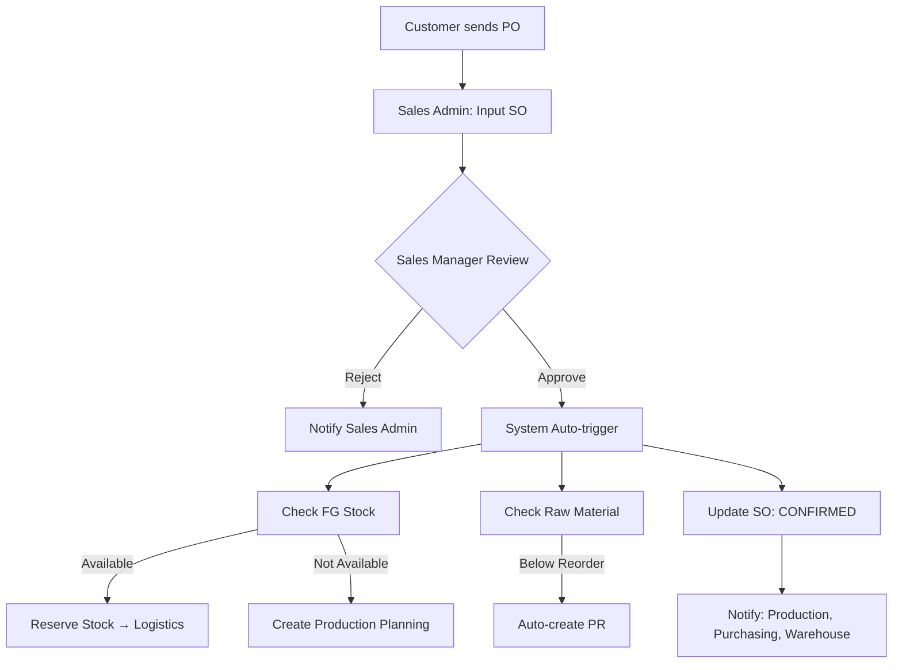
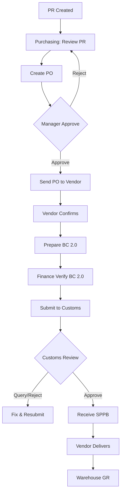
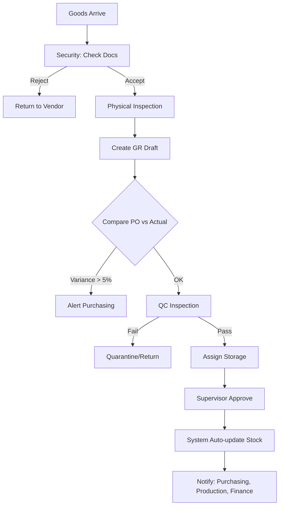
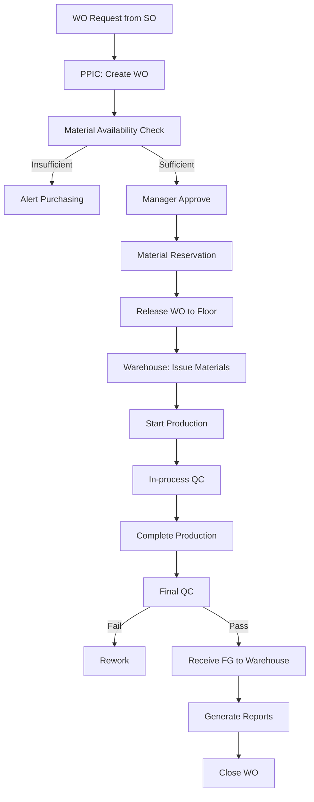
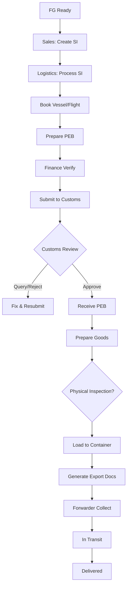
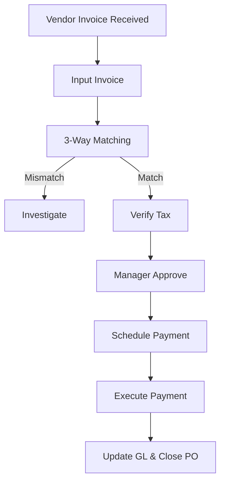
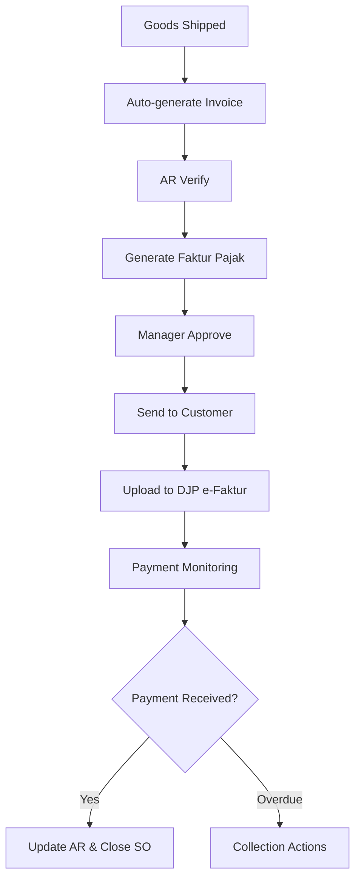

# Detailed Workflow Specifications

> **Source**: User-provided comprehensive workflow documentation
> **Date**: 2026-02-05

## Overview

This document captures the complete end-to-end workflow specifications for the ERP system, covering all modules from Sales Order to Finance, including customs compliance (BC 2.0 PIB Regular Import and PEB Export).

---

## A. Sales Order Workflow

### Process Flow

### Status Flow

`DRAFT` → `PENDING APPROVAL` → `APPROVED` → `IN PRODUCTION` → `READY TO SHIP` → `COMPLETED`

### Key Fields

- Customer, Product, Quantity, Delivery Date
- PO Document Upload
- Credit Limit Check
- Stock Availability Check

### Auto-triggers

- FG Stock check → Reserve or Create WO
- Raw Material check → Create PR if below reorder point
- Notifications to Production, Purchasing, Warehouse

---

## B. Purchasing & BC 2.0 (PIB - Regular Import) Workflow

### Process Flow

### BC 2.0 Status Flow

`NOT REQUIRED` / `DRAFT` → `SUBMITTED` → `UNDER REVIEW` → `QUERY` → `APPROVED` → `CLOSED`

### PO Status Flow

`DRAFT` → `PENDING APPROVAL` → `APPROVED` → `SENT TO VENDOR` → `PARTIALLY RECEIVED` → `COMPLETED`

### Key Documents

- Commercial Invoice, Packing List, B/L
- HS Code, Origin, Value
- Duties & Taxes calculation (Bea Masuk, PPN, PPh 22)
- SPPB (Surat Persetujuan Pengeluaran Barang)

### Implementation Features ✅

**BC 2.0 Management** (`/purchasing/bc20`)

- Dashboard with stats (Pending, Approved, Total Value)
- List view with status badges
- Search and filter capabilities
- Quick navigation to detail pages

**BC 2.0 Detail Page** (`/purchasing/bc20/[id]`)

- Complete document information (BC number, PO reference, Supplier)
- Goods details with HS Code
- Duty calculations breakdown (Bea Masuk, PPN, PPh 22)
- **Dual billing**: vendor CIF payment + tax payment separately
- **Landed cost calculation**
- **Tax assets**: PPN credit & PPh 22 prepaid tracking
- SPPB tracking
- Document checklist (Invoice, Packing List, B/L, COO)
- Status timeline visualization
- Activity log with audit trail
- **Lot Number Assignment** for material traceability

### Critical Data Points

- **Lot Number**: Assigned at import for full traceability (e.g., `RM-2026-001`)
- **HS Code**: Required for duty calculation
- **CIF Value**: Basis for customs duties
- **Duty Breakdown**: Bea Masuk + PPN + PPh 22 = Total Duties
- **SPPB Number**: Customs clearance approval reference

---

## C. Warehouse Receiving (GR) Workflow

### Process Flow

### Status Flow

`PENDING ARRIVAL` → `DRAFT GR` → `QC INSPECTION` → `APPROVED` → `STOCK UPDATED`

### Key Actions

- Physical count, quality check, weighing
- Photo documentation
- BC 2.0 verification (for imports)
- 3-way matching trigger (PO-GR-Invoice)
- Stock card update, Laporan Mutasi Stok

---

## D. Production Workflow

### Process Flow

### Status Flow

`DRAFT` → `APPROVED` → `MATERIAL RESERVED` → `RELEASED` → `IN PROGRESS` → `COMPLETED` → `QC PASS` → `FG RECEIVED` → `CLOSED`

### Key Reports Auto-generated

1. **Laporan Hasil Produksi**
   - Target vs Actual output
   - Efficiency metrics
   - Quality metrics

2. **Konversi Bahan Baku Report** ✅ (`/reports/production`)
   - Raw material consumed (with BC 2.0 reference)
   - Finished goods produced (with lot number)
   - Conversion ratio (actual vs standard)
   - Variance analysis (standard vs actual)
   - Waste/scrap tracking
   - **Full Traceability**: BC 2.0 (import) → GR → WO → FG → PEB (export)

### Material Traceability System ✅

**Traceability Chain** (`/reports/traceability`)

- Visual flow: BC 2.0 → Goods Receipt → Work Order → Finished Goods → PEB
- Lot/batch tracking throughout the chain
- Conversion analysis with variance
- Material Traceability Certificate generation
- Search by: Lot Number, BC 2.0, PEB, WO, PO

**Key Traceability Data**:

- RM Lot Number (from BC 2.0): `RM-2026-001`
- FG Lot Number (from WO): `FG-2026-001`
- Conversion Ratio: Actual vs Standard
- Variance %: Performance indicator
- Waste Quantity: For audit compliance

---

## E. Logistics & PEB (Export) Workflow

### Process Flow

### PEB Status Flow

`DRAFT` → `VERIFIED` → `SUBMITTED` → `UNDER REVIEW` → `APPROVED` → `EXPORTED` → `CLOSED`

### Shipment Status Flow

`DRAFT SI` → `CONFIRMED` → `PEB SUBMITTED` → `PEB APPROVED` → `LOADED` → `IN TRANSIT` → `DELIVERED` → `COMPLETED`

### Key Documents

- Commercial Invoice, Packing List
- Certificate of Origin (Form E, etc)
- Health Certificate
- PEB (Pemberitahuan Ekspor Barang)
- NPE (Nomor Pendaftaran Eksportir)
- Bill of Lading / Airway Bill
- POD (Proof of Delivery)

### Implementation Features ✅

**PEB Management** (`/logistics/peb`)

- Dashboard with stats (Pending, Approved, Total Export Value)
- List view with PEB tracking
- Status badges and filters
- Quick access to detail pages

**PEB Detail Page** (`/logistics/peb/[id]`)

- Complete export declaration information
- PEB (Pemberitahuan Ekspor Barang) tracking
- NPE (Nomor Pendaftaran Eksportir) display
- **Zero-rated VAT (0% PPN)** for export
- **FOB value** calculation
- **Optional Traceability Chain**: Links back to BC 2.0 and WO
- Conversion analysis display
- Document checklist (Invoice, Packing List, COO, Health Cert, Form E)
- Status timeline
- Activity log

### Material Traceability Integration

**PEB to BC 2.0 Linkage**:

- Each PEB export optionally links to source BC 2.0 import(s)
- Traceability chain visible on PEB detail page
- Shows: BC 2.0 → GR → WO → FG → PEB
- Conversion ratio and waste tracking
- Compliance audit trail

**Stock Movement Report** ✅ (`/reports/stock-movement`)

- Period & material filters
- Balance summary (Opening, In, Out, Closing)
- Transaction breakdown by type:
  - Import (BC 2.0 references)
  - Production (WO references)
  - Export (PEB references)
  - Waste/Scrap
- Detailed transaction table with lot tracking
- BC references for all movements
- Export to Excel functionality

---

## F. Finance Workflow

### Accounts Payable (AP)

### Accounts Receivable (AR)

### Invoice Status Flow

`DRAFT` → `APPROVED` → `SENT` → `PARTIALLY PAID` → `PAID` / `OVERDUE`

---

## G. Integration & Auto-triggers

### Cross-Module Triggers

| Trigger Event       | Auto Actions                                                                                                               |
| :------------------ | :------------------------------------------------------------------------------------------------------------------------- |
| **SO APPROVED**     | Check FG Stock → Reserve or Create WO Check Raw Material → Create PR if low Update Sales Dashboard                   |
| **PO APPROVED**     | Notify Warehouse for GR prep Create BC 2.0 template (imports) Update Purchasing Dashboard                            |
| **BC 2.0 APPROVED** | Notify Warehouse: Ready to receive Allow GR creation Update Compliance Dashboard                                     |
| **GR COMPLETED**    | Update Inventory Notify Production: Material available Trigger AP: Invoice matching Generate Laporan Mutasi Stok  |
| **WO COMPLETED**    | Update FG Inventory Generate Production Reports Generate Konversi Bahan Baku Notify Logistics Update SO status |
| **PEB APPROVED**    | Allow shipment Generate export documents Update Compliance Dashboard                                                  |
| **GOODS SHIPPED**   | Update FG Stock Auto-generate Sales Invoice Update SO: SHIPPED Start shipment tracking                            |
| **INVOICE CREATED** | Generate Faktur Pajak Schedule email to customer Start payment monitoring Update AR Dashboard                     |

---

## H. Approval Matrix

| Document             | Level 1              | Level 2               | Level 3                       | Level 4          |
| :------------------- | :------------------- | :-------------------- | :---------------------------- | :--------------- |
| **Sales Order**      | Sales Admin (Create) | Sales Manager (>50M)  | Director (>500M)              | -                |
| **Purchase Request** | Requestor            | Dept Head             | Purchasing Mgr (>25M)         | -                |
| **Purchase Order**   | Purchasing Staff     | Purchasing Mgr (>50M) | Finance Mgr (>100M)           | Director (>500M) |
| **Goods Receipt**    | Warehouse Staff      | Warehouse Supervisor  | Purchasing Mgr (variance >5%) | -                |
| **Work Order**       | PPIC                 | Production Manager    | -                             | -                |
| **BC 2.0**           | Purchasing           | Finance               | Customs (External)            | -                |
| **PEB**              | Logistics            | Finance               | Customs (External)            | -                |
| **Payment Voucher**  | AP Staff             | Finance Mgr (>25M)    | Director (>250M)              | -                |
| **Sales Invoice**    | AR Staff             | Finance Manager       | -                             | -                |

---

## I. Notification System

### Email Notifications

- SO Approved → Production (New WO needed)
- Stock below reorder → Purchasing (Create PR)
- PO Approved → Vendor (PO attached)
- GR Completed → Purchasing + Finance
- BC Submitted → Finance
- BC Approved → Warehouse/Logistics
- WO Completed → QC + Logistics
- Goods Shipped → Customer + Sales (tracking)
- Invoice Sent → Customer (Invoice + Faktur)
- Payment Due (3 days before) → Customer
- Payment Overdue → AR + Sales Manager

### Dashboard Alerts

🔴 **Critical**

- Stock critical level (<20% of reorder point)
- BC document rejected
- Payment overdue >30 days
- Production WO delayed >24 hours

🟡 **Warning**

- Stock below reorder point
- BC pending >3 days
- Payment due within 7 days
- PO delivery overdue

🟢 **Info**

- New SO awaiting approval
- GR completed
- WO completed
- Shipment delivered

---

## I-A. Customs Compliance Dashboard ✅

### Overview (`/compliance`)

**Centralized Monitoring**:

- Real-time BC 2.0 & PEB status tracking
- Compliance alerts and notifications
- Traceability overview
- Recent activity feed

### Key Metrics Displayed

**BC 2.0 Import Status**:

- Total active documents
- Pending review count
- Approved this month
- Recent documents with quick links

**PEB Export Status**:

- Total active documents
- Pending review count
- Approved this month
- Recent documents with quick links

**Material Traceability**:

- Total traceability records
- Exported vs pending
- Traceability gaps detection
- Progress tracking

**Compliance Alerts**:

- BC 2.0 pending review
- PEB pending review
- Traceability gaps warning
- "All Clear" status when no issues

### Integration with Executive Dashboard

**Executive Dashboard Updates** (`/`)

- Customs Compliance widget added
- Shows total pending approvals (BC 2.0 + PEB)
- Color-coded alerts (Green = All Clear, Orange = Pending)
- Quick link to Compliance Dashboard
- Recent activities include BC approvals and traceability completions

---

## J. Reporting Requirements

### Daily Reports (Auto 06:00)

- Production Summary (yesterday)
- **Stock Movement Report** ✅ (with BC references)
- **BC Status Dashboard** ✅ (BC 2.0 & PEB pending)
- Cash Flow Daily

### Weekly Reports (Monday 08:00)

- Sales Performance
- Production Efficiency
- Inventory Aging
- AP/AR Aging
- **Customs Compliance Summary** ✅

### Monthly Reports (1st 08:00)

- Financial Statement (P&L, Balance Sheet)
- **BC 2.0 & PEB Summary** ✅
- **Material Traceability Report** ✅
- **Production Conversion Report** ✅ (with variance analysis)
- SPT PPN (Tax report)
- Vendor Performance
- Customer Sales Analysis

### On-Demand Reports

- **Material Traceability Certificate** ✅ (customs audit)
- **Stock Movement by Material** ✅ (period-based)
- **Konversi Bahan Baku Analysis** ✅ (RM to FG conversion)
- Production Cost Analysis
- SO Fulfillment Report
- Quality Metrics Report

### Customs Audit Reports ✅

**For Bea Cukai Compliance**:

1. **BC 2.0 to PEB Reconciliation**
   - Import quantities vs Export quantities
   - Conversion ratios and waste
   - Full traceability chain

2. **Material Traceability Certificate**
   - Lot-to-lot tracking
   - BC 2.0 source → PEB destination
   - Conversion analysis with variance

3. **Stock Movement Report**
   - All transactions with BC references
   - Opening/Closing balances
   - Import, Production, Export breakdown

---

## Next Steps

This specification will guide the implementation plan for:

1. Database schema design
2. API endpoints definition
3. UI/UX flow implementation
4. Integration logic
5. Approval workflow engine
6. Notification system
7. Reporting module
